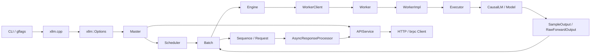

# xLLM 整体执行框架学习笔记

## 1. 这份笔记要回答什么

基于 `overview.md` 已经完成的启动入口与配置体系梳理，我继续往下补齐了 xLLM 的主执行链，目标不是“知道有哪些目录”，而是建立一套可以复述的整体执行框架：

1. xLLM 启动后，系统内部是如何被组织起来的。
2. 一个请求如何从 HTTP/OpenAI 风格接口进入，一路走到模型执行，再把结果返回给客户端。
3. `Master / Scheduler / Engine / Worker / WorkerImpl / Executor / Model` 这些骨架类的边界到底在哪里。
4. 为什么 xLLM 能同时支持 LLM/VLM/DiT/Rec、单机/多机、prefix cache / PD / speculative / xTensor 这些能力。

当前分析以 `LLM + chat/completion` 主路径为基线，因为它最能代表 xLLM 的核心骨架。`VLM / DiT / Rec` 在主干结构上复用同一套框架，只是在 `Master / Engine / WorkerImpl / APIServiceImpl` 上替换了任务特化实现。

## 2. 我建立的整体认知框架

我把 xLLM 理解成 3 条主线 + 2 个关键边界：

### 2.1 三条主线

1. 启动线  
   `xllm.cpp -> Options -> Master -> Engine -> APIService -> XllmServer`

2. 请求线  
   `APIService -> ServiceImpl -> LLMMaster::handle_request -> Scheduler -> Batch`

3. 执行线  
   `Batch -> LLMEngine -> WorkerClient -> Worker -> WorkerImpl -> Executor -> CausalLM -> SampleOutput -> Batch -> RequestOutput`

### 2.2 两个关键边界

1. 配置边界  
   `CLI flags -> xllm::Options -> runtime::Options`

2. 控制/执行边界  
   `Master + Scheduler` 负责控制面，`Engine + Worker` 负责执行面

如果只记一句话，我会这样描述 xLLM：

> xLLM 不是“一个模型 + 一个 server”，而是一套把协议接入、请求调度、设备执行、模型特化、多机扩展统一组织起来的推理运行时骨架。

## 3. 分层总图



## 4. 分层职责表

| 层次 | 核心对象 | 主要职责 | 关键边界 |
|---|---|---|---|
| 启动编排层 | `xllm.cpp` | 解析 flag、推导 backend/capability、创建 `Master` 和 server | 把外部输入整理成内部事实 |
| 服务接入层 | `APIService`、`*ServiceImpl`、`Call` | 协议适配、JSON/Proto 解析、stream/non-stream 回调写回 | 不直接跑模型 |
| 控制层 | `Master`、`LLMMaster` | 请求构造、tokenizer/chat template、scheduler 循环、rate limit | 不直接做设备执行 |
| 调度层 | `Scheduler`、`ContinuousScheduler` | waiting/running 队列、budget、preemption、batch 组装 | 决定“谁在这一轮执行” |
| 数据骨架层 | `Request`、`Sequence`、`Batch` | 请求状态、token 状态、执行输入/输出承载 | 连接服务语义与执行语义 |
| 执行桥接层 | `Engine`、`LLMEngine` | 把 batch 下发到 worker，汇总结果，管理 KV cache 资源 | 连接 scheduler 与 worker |
| 运行时执行层 | `WorkerClient`、`Worker`、`WorkerImpl` | 屏蔽本地/远端差异，持有设备资源并执行 forward | 真正靠近设备与模型 |
| 模型执行层 | `Executor`、`CausalLM` | 准备输入、调用模型前向、输出 logits/hidden states | 把 batch 变成模型算子调用 |
| 平台优化层 | `ExecutorImpl`、KV transfer、xTensor、Graph | 平台特化、图执行、内存/权重/KV 迁移优化 | 面向硬件和系统优化 |

## 5. 启动线：系统是怎么被拉起来的

这一部分承接 `overview.md`，但这里重新放进“整体框架”里理解。

### 5.1 启动时序

```mermaid
sequenceDiagram
    participant CLI as CLI/gflags
    participant Main as main/run
    participant Opt as xllm::Options
    participant Master as Master
    participant Engine as Engine
    participant API as APIService
    participant Server as XllmServer

    CLI->>Main: --model / --backend / --task / ...
    Main->>Main: 解析 flag, 推导 backend/model_type/use_mla
    Main->>Opt: 组装 xllm::Options
    Main->>Master: create_master()
    Master->>Engine: 在构造函数里立即创建 Engine
    Main->>Master: master->run()
    Main->>API: 构造 APIService(master)
    Main->>Server: 注册并启动 HttpServer
    Server->>Server: RunUntilAskedToQuit()
```

### 5.2 启动阶段最重要的设计点

1. `xllm.cpp` 不是纯粹的 `main`，它是启动语义编排器。  
   很多关键语义都在这里被“定死”，比如 `backend` 自动推导、`use_mla` 派生、parser 自动选择、`enable_cache_upload`/`enable_kvcache_store` 组合开关。

2. `Master` 在构造时就创建 `Engine`。  
   所以 `master->run()` 的含义是“启动调度循环”，不是“创建执行引擎”。

3. `APIService` 在 `master->run()` 之后才创建。  
   这说明 API 层只是上层协议壳，不是系统初始化源头。

4. 配置是三层的。  
   `FLAGS_*` 是原始输入，`xllm::Options` 是控制面配置，`runtime::Options` 是执行面配置。

### 5.3 `backend` 与 `model_type` 的角色不同

- `backend` 决定主骨架：走 `llm / vlm / dit / rec` 哪一套 `Master/Engine/APIServiceImpl`。
- `model_type` 决定能力细节：例如 `use_mla`、parser、某些模型能力兼容性。

我现在的理解是：xLLM 启动时先选“系统骨架”，再选“模型能力”。

## 6. 请求线：一个 API 请求如何进入系统

### 6.1 服务入口不是直接执行模型

`APIService` 只是统一协议入口。它会根据 `FLAGS_backend` 构造不同的 service impl：

- `llm`: `CompletionServiceImpl`、`ChatServiceImpl`、`EmbeddingServiceImpl`、`RerankServiceImpl`
- `vlm`: 多模态 chat / embedding service
- `dit`: 图像生成 service
- `rec`: recommendation completion/chat service

对 HTTP 请求来说，流程是：

1. `APIService::*Http()` 把 HTTP body 从 JSON 解析成 proto。
2. 构造 `Call` 对象，封装 brpc controller、done closure、response。
3. 转交给具体 `*ServiceImpl::process_async()`。

所以 `APIService` 的本质是：

- 做协议适配
- 做模型/后端路由
- 不做调度，不做执行

### 6.2 ServiceImpl 把外部请求转成内部请求

以 `ChatServiceImpl` / `CompletionServiceImpl` 为例，它们会做四件事：

1. 校验模型是否存在。
2. 检查 `RateLimiter` 与 sleep 状态。
3. 把 proto 请求转换成 `RequestParams`，并整理出：
   - `prompt` 或 `messages`
   - 可选的 `prompt_tokens`
   - stream/non-stream 回调
   - tool/reasoning 解析上下文
4. 调用 `master->handle_request(...)`

这一层的重要结论是：

- OpenAI 风格请求不会直接进入 scheduler。
- 它会先被压缩成 `prompt/messages + RequestParams + callback` 这组内部语义。

### 6.3 stream 与 non-stream 的分叉点

stream 和 non-stream 在服务层就开始分叉，但不是两套执行引擎：

- stream：callback 会持续接收 `RequestOutput` 增量，并通过 `call->write()` 输出 chunk
- non-stream：callback 会等到最终结果后通过 `write_and_finish()` 一次性返回

也就是说，执行面是同一套，差异主要体现在：

1. `RequestState.stream`
2. `AsyncResponseProcessor` 如何生成输出
3. service callback 如何写回客户端

## 7. 控制层：`LLMMaster` 如何接住请求

### 7.1 `LLMMaster` 构造阶段就完成三件大事

`LLMMaster` 构造函数里，不只是“保存 options”，它已经把运行时主骨架拼起来了：

1. `engine_->init(...)`
2. `create_continuous_scheduler(engine_.get(), scheduler_options)`
3. 初始化 `chat_template_`、`tokenizer_`、请求处理线程池

因此 `LLMMaster` 不是一个薄壳，而是：

- 上接服务层
- 下接 scheduler/engine
- 中间还负责 chat template 和 request 构造

### 7.2 `handle_request()` 的真实职责

`LLMMaster::handle_request()` 并不立即执行请求，而是：

1. `scheduler_->incr_pending_requests(1)`
2. 把请求处理任务丢到 threadpool
3. 在后台线程里做：
   - `verify_params()`
   - 文本请求 tokenize，chat 请求先用 `JinjaChatTemplate` 转 prompt
   - 构造 `RequestSamplingParam`、`SchedulerParam`、`StoppingChecker`
   - 组装 `RequestState`
   - 创建 `Request`
4. 最后调用 `scheduler_->add_request(request)`

这里有个很重要的分层：

- service impl 负责“协议请求 -> `RequestParams`”
- `LLMMaster` 负责“`RequestParams` -> `Request`”
- scheduler 负责“`Request` -> `Batch`”

### 7.3 `Request` 是服务语义进入调度语义的边界对象

`Request` 内部持有 `RequestState` 和 `SequencesGroup`。  
`RequestState` 包含：

- sampling 参数
- scheduler 参数
- stopping checker
- streaming / callback
- echo / logprobs / sample slots
- optional `Call*`

这意味着从 `Request` 开始，系统已经不再关心 HTTP 或 OpenAI 协议长什么样，而只关心：

- 这个请求有多少 sequence
- 它还要不要继续生成
- 它的回调怎么返回
- 它的优先级和 SLO 是什么

## 8. 调度层：`ContinuousScheduler` 如何组织执行

### 8.1 scheduler 维护的不是一个队列，而是一组状态容器

`ContinuousScheduler` 内部同时维护：

- `request_queue_`: 新请求进入的线程安全队列
- `waiting_priority_queue_`: 等待首次调度的在线请求
- `waiting_priority_queue_offline_`: 等待首次调度的离线请求
- `running_queue_`: 已经拥有 KV cache、可继续 decode 的在线请求
- `running_queue_offline_`: 离线 decode 请求
- `running_requests_` / `running_sequences_`: 当前 step 真正被选中的请求和 sequence

这说明 xLLM 的 scheduler 不是简单的 FIFO，而是显式地区分：

1. 新请求
2. 等待 prefill 的请求
3. 已经进入 decode 的请求
4. 在线/离线优先级

### 8.2 `prepare_batch()` 是 scheduler 的核心装配点

`prepare_batch()` 主要做这些事情：

1. 从 `request_queue_` 读出新请求，放进 waiting queue。
2. 清理 finished/cancelled 的 running request，并释放 KV block。
3. 把上轮 running request 重新放回 running queue。
4. 在 token budget / seq budget / latency budget / KV block 约束下：
   - 先尝试调度 prefill
   - 如果这一轮没有 prefill，再调度 decode
5. 通过 `BatchFactory` 把 `running_requests_ + running_sequences_ + budgets` 组装成 `Batch`。
6. 触发 `kv_cache_manager_->transfer_blocks(...)`

这里可以看出 xLLM 的 continuous batching 不是“所有请求混一起”，而是一个带资源预算和阶段感知的 batch 装配过程。

### 8.3 调度的真正粒度是 `Sequence`

虽然 scheduler 接收的是 `Request`，但真正被放进 batch 的是 `Sequence`。

原因很关键：

- 一个 request 可以有多条 sequence（如 `n` / `best_of` / beam）
- sequence 会经历 `PREFILL -> CHUNKED_PREFILL -> DECODE`
- KV cache、stop condition、streaming 输出都更贴近 sequence 粒度

所以 xLLM 的调度逻辑本质上是：

> 以 request 为管理单位，以 sequence 为执行单位。

### 8.4 `step()` 的意义

`ContinuousScheduler::step()` 的骨架非常清晰：

1. `schedule_request(timeout)` 得到本轮 batch
2. `engine_->step(batch)` 执行本轮 batch
3. `process_batch_output(...)` 把结果转成请求输出

如果开启 `enable_schedule_overlap`，它会变成两段式流水：

1. 当前 step 先下发下一批输入
2. 再通过 `engine_->update_last_step_result(last_batch_)` 回收上一轮真正结果

这说明 schedule overlap 不是一个外围优化，而是直接改写了 scheduler 和 worker 之间的 step 语义。

## 9. 数据骨架：`Request / Sequence / Batch` 为什么是这样拆的

### 9.1 `Request`

`Request` 是请求生命周期管理者，负责：

- 保存 request 级参数与 callback
- 持有 `SequencesGroup`
- 判断 finished/cancelled
- 生成最终 `RequestOutput`

它更像“业务级容器”。

### 9.2 `Sequence`

`Sequence` 是真正的 token 生成单元，负责：

- 保存 token 列表
- 维护 `SequenceStage`
- 维护 KV 状态
- 处理 stop / eos / finish_reason
- 生成 streaming output 或 full output

它更像“运行时生成状态机”。

### 9.3 `Batch`

`Batch` 是 scheduler 和 engine 之间的桥：

- `prepare_forward_input(...)` 把 sequence 变成模型输入
- `process_sample_output(...)` 把 worker 结果回写到 sequence

所以 `Batch` 的关键价值不是“装一堆 sequence”，而是：

> 它同时承担了输入打包和输出回写这两个边界职责。

这也是为什么 `Batch` 在整个主链里非常关键。

## 10. 执行桥：`LLMEngine` 如何把 batch 落到 worker

### 10.1 `Engine` 的定位

`Engine` 不是模型，也不是 scheduler。  
它在系统里的准确定位是：

- 向上承接 scheduler 产出的 batch
- 向下驱动本地/远端 worker 执行
- 管理 KV cache 资源与多 worker 并发

所以我把它理解成“执行桥”。

### 10.2 `LLMEngine` 初始化时做什么

`LLMEngine` 构造时会：

1. 通过 `DistManager` 建立 `worker_clients_`
2. 计算 DP/TP 相关拓扑
3. 创建线程池

随后 `init()` 会：

1. `init_model(master_status)`
2. 估算 KV cache 容量
3. 分配 KV cache

这说明 `Engine` 的初始化重点并不是“提供 API”，而是：

- 搭 worker 集群
- 加载模型
- 初始化 KV cache

### 10.3 `LLMEngine::step()` 的核心流程

`LLMEngine::step()` 主要做四件事：

1. `prepare_inputs(batch)`  
   把每个 DP micro-batch 变成 `RawForwardInput`

2. fan-out 到 worker  
   对所有 `worker_clients_` 调用 `step_async(raw_forward_inputs[dp_rank])`

3. 等所有 worker 完成  
   `folly::collectAll(futures).get()`

4. fan-in 回 batch  
   只读取每个 DP 组 driver worker 的输出，再调用  
   `batch[dp_rank].process_sample_output(...)`

所以 `Engine` 的本质是一个“批量并发执行器”：

- 向下 fan-out
- 向上 fan-in

### 10.4 为什么需要 `WorkerClient`

`WorkerClient` 的存在非常合理，因为它统一了两种调用方式：

- 本地 `Worker`
- 远端 `RemoteWorker`

这样 `LLMEngine` 不需要关心：

- worker 是线程内对象
- 还是 RPC 对端

这就是 xLLM 多机扩展的关键抽象点之一。

## 11. 多机扩展：`DistManager` 怎么把执行拓扑搭起来

`DistManager` 是执行面里的拓扑组织者。

它负责：

1. 根据 `world_size / dp_size / ep_size / node_rank` 计算并行拓扑。
2. 在本机启动 `WorkerServer` 或本地 worker。
3. 在 master 节点上启动 `CollectiveServer`。
4. 等待所有 worker 上报地址。
5. 为每个 rank 创建 `RemoteWorker`，最终暴露成统一的 `WorkerClient`。

所以多机场景不是在 scheduler 层“额外套一层”，而是在 `Engine -> WorkerClient` 这一段自然扩展出来的。

这也是 xLLM 框架设计里我认为很漂亮的一点：

> 调度层不用关心 worker 是本地还是远端；执行拓扑的复杂性被 `DistManager + WorkerClient` 吃掉了。

## 12. 设备执行骨架：`Worker -> WorkerImpl -> Executor -> Model`

### 12.1 `Worker` 只是门面

`Worker` 自己几乎不承载复杂逻辑，它的核心作用是：

- 根据 `WorkerType` 选择具体实现
- 把外部调用转发给 `WorkerImpl`

例如：

- `LLMWorkerImpl`
- `VLMWorkerImpl`
- `RecWorkerImpl`
- speculative 相关 worker impl

所以 `Worker` 是门面，`WorkerImpl` 才是真骨架。

### 12.2 `WorkerImpl` 持有真正的运行时资源

`WorkerImpl` 里持有的核心资源包括：

- `ModelContext`
- `Device`
- `prepare_stream_` / `compute_stream_`
- `kv_caches_`
- `model_`
- `model_executor_`
- `sampler_`
- KV transfer / hierarchy transfer
- schedule overlap 上一轮输出缓存

因此 `WorkerImpl` 的本质不是“一个 forward 函数”，而是：

> 一个设备侧的运行时骨架对象。

### 12.3 `ModelContext` 为什么重要

`ModelContext` 把这些信息绑在一起：

- `ParallelArgs`
- `ModelArgs`
- `QuantArgs`
- `TensorOptions`
- `use_mla`
- 自动推导出的 `OptimizationConfig`

这意味着模型实例化不再只是“读 checkpoint”，而是把：

- 模型结构
- 量化参数
- 并行拓扑
- 平台优化能力

整合成一个统一上下文。  
这是 xLLM 能把“模型层”和“平台层”接起来的关键中介。

### 12.4 `WorkerImpl::init_model()` 的意义

`WorkerImpl::init_model(...)` 会：

1. 用 `ModelLoader` 读取模型元数据和 tokenizer
2. 构造 `ModelContext`
3. 调用子类 `init_model(context_)`
4. 加载权重或 lazy load 权重

这里的分层很清楚：

- 基类 `WorkerImpl` 负责运行时通用初始化
- 子类 `LLMWorkerImpl` / `VLMWorkerImpl` 负责把具体模型接上去

### 12.5 `Executor` 的位置

`Executor` 是模型执行门面：

- `prepare_inputs(batch)`
- `forward(tokens, positions, kv_caches, params)`

它内部再通过 `ExecutorImplFactory` 根据 backend/device/graph 选择具体实现。

所以 `Executor` 是：

- 上接 batch/runtime 抽象
- 下接平台/算子实现

### 12.6 `LLMWorkerImpl::step()` 真正发生了什么

`LLMWorkerImpl::step()` 主体可以概括为：

1. 如有需要，先处理 KV transfer / EPLB 等前置逻辑
2. `model_executor_->forward(...)` 得到 `ModelOutput`
3. 如果当前 worker 是 driver，则：
   - 从 hidden states 取 logits
   - 通过 `Sampler` 做采样
   - 如有 beam search 则额外处理 beam 结果
4. 如果开启 speculative，还会附带 embeddings / speculative 结果
5. 返回 `ForwardOutput`

这说明 xLLM 的设备执行主链可以压成一句话：

> `Executor` 负责跑模型，`Sampler` 负责把 logits 变成 token，`WorkerImpl` 负责把这整个执行过程组织起来。

## 13. 结果如何回流到客户端

### 13.1 batch 先回写 sequence

worker 返回 `RawForwardOutput` 之后，`Batch::process_sample_output()` 会把：

- token
- embeddings
- finish_reason
- beam 结果

回写到 `Sequence`。

所以真正的“模型输出状态”首先进入的是 `Sequence`，不是直接进入 HTTP response。

### 13.2 scheduler 再决定哪些请求该回调

`ContinuousScheduler::process_batch_output()` 会区分：

- streaming request
- completed request
- overlap 模式下 last token 是否已处理

然后把需要回调的 request 交给 `AsyncResponseProcessor`。

### 13.3 `AsyncResponseProcessor` 做最终输出整理

它负责两类工作：

1. `process_stream_request(s)`  
   从 sequence 生成 delta output，并调用 request callback

2. `process_completed_request(s)`  
   调用 `Request::generate_output()` 生成完整 `RequestOutput`

这里 tokenizer 会在最后一步把 token ids 解码成文本。  
因此输出回流路径是：

`Sequence` 状态 -> `RequestOutput` -> service callback -> HTTP/brpc 响应

### 13.4 rate limit 何时释放

这一点也很关键。  
rate limiter 的请求数释放并不发生在 scheduler，而主要发生在 service callback 中：

- finished
- cancelled
- error
- prefill instance 完成首 token 返回

这说明并发控制和实际响应回流是强绑定的。

## 14. xLLM 为什么能扩成一个“大框架”

### 14.1 同一骨架支持多 backend

主扩展点有四层：

1. `create_master()`  
   选择 `LLMMaster / VLMMaster / DiTMaster / RecMaster`

2. `Engine`  
   选择 `LLMEngine / VLMEngine / RecEngine / SpeculativeEngine`

3. `WorkerImpl`  
   选择 `LLMWorkerImpl / VLMWorkerImpl / RecWorkerImpl / ...`

4. `APIServiceImpl`  
   选择 completion/chat/embedding/image generation/rerank 等协议适配

所以新任务并不是重写整套框架，而是沿着这些扩展点替换局部实现。

### 14.2 同一骨架支持多部署模式

单机、多机、PD、service routing、global KV cache 这些能力主要挂在：

- `Options / runtime::Options`
- `ContinuousScheduler`
- `LLMEngine`
- `DistManager`
- `WorkerClient`
- KV transfer 体系

也就是说，xLLM 把“部署模式变化”大多限制在调度层和执行桥层，没有把复杂性泄漏到服务层。

### 14.3 同一骨架支持平台优化

图执行、xTensor、rolling load、KV cache transfer、EPLB、custom kernel 等能力主要挂在：

- `WorkerImpl`
- `Executor`
- `ModelContext`
- 平台/算子实现

这说明 xLLM 的优化不是 scattered hack，而是有明确落点的。

## 15. 我对 xLLM 的最终理解

### 15.1 一句话理解

xLLM 的核心价值不只是“支持很多模型”，而是把推理系统拆成了清晰的控制面与执行面：

- 控制面负责接请求、建请求、调请求
- 执行面负责管 worker、跑 forward、管 cache、做平台优化

### 15.2 我心里的主骨架

```text
启动编排
  -> 控制面配置固化
  -> Master 组装 Engine + Scheduler
  -> 服务层接请求
  -> Master 把请求转成 Request
  -> Scheduler 把 Request/Sequence 转成 Batch
  -> Engine 把 Batch fan-out 到 Worker
  -> WorkerImpl/Executor/CausalLM 执行模型
  -> Batch/Request 回写输出
  -> AsyncResponseProcessor / APIService 返回结果
```

### 15.3 我认为最关键的设计取舍

1. `APIService` 不碰执行细节，只做协议适配。
2. `Master` 不直接跑模型，只负责编排请求与驱动调度。
3. `Scheduler` 不关心本地/远端 worker，只关心“这一轮谁执行”。
4. `Engine` 不关心 HTTP 协议，只关心“如何把 batch 下发并收回”。
5. `WorkerClient` 屏蔽本地/远端差异，让多机扩展自然发生。
6. `WorkerImpl` 统一承载设备侧复杂度，让平台优化有稳定落点。
7. `Request / Sequence / Batch` 把请求语义、生成状态、执行输入输出解耦开。

## 16. 当前阅读文件

### 16.1 启动与配置

- `xllm/xllm.cpp`
- `xllm/core/common/global_flags.h`
- `xllm/core/common/global_flags.cpp`
- `xllm/core/common/options.h`
- `xllm/core/common/options.cpp`
- `xllm/core/common/model_capability.h`
- `xllm/core/common/model_capability.cpp`
- `xllm/server/xllm_server_registry.h`
- `xllm/server/xllm_server_registry.cpp`
- `xllm/server/xllm_server.h`
- `xllm/server/xllm_server.cpp`

### 16.2 服务接入层

- `xllm/api_service/api_service.h`
- `xllm/api_service/api_service.cpp`
- `xllm/api_service/chat_service_impl.h`
- `xllm/api_service/chat_service_impl.cpp`
- `xllm/api_service/completion_service_impl.cpp`
- `xllm/api_service/embedding_service_impl.cpp`
- `docs/zh/features/xllm_service_overview.md`

### 16.3 控制/调度/执行主链

- `xllm/core/distributed_runtime/master.h`
- `xllm/core/distributed_runtime/master.cpp`
- `xllm/core/distributed_runtime/llm_master.h`
- `xllm/core/distributed_runtime/llm_master.cpp`
- `xllm/core/distributed_runtime/engine.h`
- `xllm/core/distributed_runtime/llm_engine.h`
- `xllm/core/distributed_runtime/llm_engine.cpp`
- `xllm/core/distributed_runtime/dist_manager.h`
- `xllm/core/distributed_runtime/dist_manager.cpp`
- `xllm/core/scheduler/scheduler.h`
- `xllm/core/scheduler/continuous_scheduler.h`
- `xllm/core/scheduler/continuous_scheduler.cpp`
- `xllm/core/scheduler/async_response_processor.h`
- `xllm/core/scheduler/async_response_processor.cpp`

### 16.4 数据与设备执行骨架

- `xllm/core/framework/request/request.h`
- `xllm/core/framework/request/request.cpp`
- `xllm/core/framework/request/request_state.h`
- `xllm/core/framework/request/request_params.h`
- `xllm/core/framework/request/request_output.h`
- `xllm/core/framework/request/sequence.h`
- `xllm/core/framework/batch/batch.h`
- `xllm/core/framework/batch/batch.cpp`
- `xllm/core/framework/model_context.h`
- `xllm/core/runtime/worker.h`
- `xllm/core/runtime/worker.cpp`
- `xllm/core/runtime/worker_client.h`
- `xllm/core/runtime/worker_impl.h`
- `xllm/core/runtime/worker_impl.cpp`
- `xllm/core/runtime/llm_worker_impl.cpp`
- `xllm/core/runtime/executor.h`
- `xllm/core/runtime/executor.cpp`

## 17. 证据边界与未展开部分

### 17.1 已确认

- 启动主链与配置分层
- `APIService -> LLMMaster -> ContinuousScheduler -> Batch -> LLMEngine -> WorkerClient -> Worker -> WorkerImpl -> Executor -> Model` 主路径
- stream/non-stream 回流路径
- `Request / Sequence / Batch` 之间的边界
- 多机扩展落点在 `DistManager + WorkerClient`

### 17.2 还没有逐项展开到底的部分

- `ChunkedPrefillScheduler / DisaggPDScheduler / MixScheduler` 的策略差异
- `RemoteWorker / WorkerService / WorkerServer` 的 RPC 细节
- `ModelLoader / ModelRegistry / CausalLM` 具体模型装配细节
- VLM / DiT / Rec 的具体任务实现差异
- xTensor / Graph / rolling load / EPLB / KV store 等高级特性的逐函数机制

所以这份 `structure.md` 现在已经足够支撑“整体框架理解”，但还不是所有高级特性的终稿。下一阶段如果继续深挖，最自然的顺序是：

1. `Request / Sequence / Batch` 细化
2. `ContinuousScheduler` 变体
3. `LLMEngine -> WorkerImpl` 细化
4. `ModelLoader / ModelContext / ModelRegistry`
5. 高级特性专题
