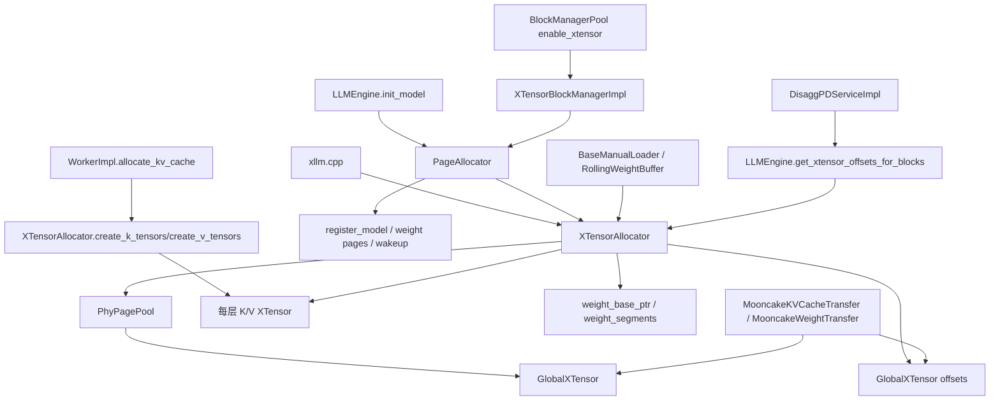

# xLLM xTensor 详细学习笔记

## 0. 说明与阅读边界

- 你问题里写的是 `overview.md` 和 `structure.md`，但仓库里实际对应文件是：
  - `ralph/learn_xllm/0-overview.md`
  - `ralph/learn_xllm/1-structure.md`
- 下面这份笔记就是以这两份已有学习笔记为入口，再向下深挖 `xllm/core/framework/xtensor/*` 及其在 `Engine / Worker / PD / Mooncake / manual loader` 主链中的实际落点。
- 这里说的 `xtensor`，**不是外部 C++ `xtensor` 数值库**，而是 xLLM 内部自己的一套**基于物理页池 + 虚拟地址映射 + 全局偏移寻址**的执行期内存系统。
- 我尽量只写源码能直接支持的结论；如果某一处是我根据多个文件拼起来的解释，我会明确写成“我的判断 / 推断”。

---

## 1. 先给结论：xLLM 里的 xTensor 本质上是一套“页化显存虚拟化系统”

如果只允许我用一句话概括 xLLM 的 `xtensor`，我现在会这样说：

> `xtensor` 不是一个普通 tensor 封装，而是一套把 **KV cache、模型权重、远端传输、sleep/wakeup、分布式偏移寻址** 统一到“物理页池 + 虚拟映射 + 全局地址空间”上的运行时内存系统。

它至少同时承担了 6 类职责：

1. **物理页池管理**：预分配固定粒度物理页，避免运行期频繁设备内存申请。
2. **KV Cache 虚拟化**：每层 K/V cache 都是一个 `XTensor`，按页 map/unmap，而不是整块静态分配。
3. **模型权重承载**：权重优先从 `GlobalXTensor` 右侧连续页里切片，失败时再退化到非连续页 fallback。
4. **统一全局偏移寻址**：通过 `GlobalXTensor` 把所有物理页放进一个大虚拟地址空间，为 Mooncake / PD 提供稳定 offset。
5. **sleep/wakeup 的页级回收与恢复**：模型睡眠时释放页，唤醒时按原虚拟页关系重建映射。
6. **跨节点 RPC 协调**：多机场景下通过 `XTensorDistService` 统一初始化页池、映射 KV、分配权重、查询偏移。

所以，如果把 xLLM 整体架构放在脑子里看，`xtensor` 的位置不是服务层，也不是 scheduler 策略层，而是：

> **执行骨架层 / 平台优化层的内存底座。**

这和 `0-overview.md` / `1-structure.md` 里对 xLLM 分层的定位是完全一致的：`xtensor` 是 `Worker / WorkerImpl / Executor / KV transfer / Mooncake / manual loader` 这一侧的能力，而不是 `APIService` 或 `Scheduler` 本身的职责。

---

## 2. 我现在建立的整体认知框架

我把 xLLM 的 `xtensor` 理解成下面这条主链：

```text
启动期
  xllm.cpp
    -> enable_xtensor 校验 / 自动打开 enable_manual_loader
    -> XTensorAllocator.init(device)
    -> setup_multi_node_xtensor_dist(...)
    -> init_phy_page_pools(...)
    -> PhyPagePool.init(...)
    -> GlobalXTensor.init(...)

KV cache 主链
  LLMEngine.init_model()
    -> PageAllocator.init(...)
    -> PageAllocator.register_model(model_id, num_layers, ...)
    -> WorkerImpl.allocate_kv_cache()
    -> XTensorAllocator.create_k_tensors/create_v_tensors(...)
    -> BlockManagerPool(enable_xtensor=true)
    -> XTensorBlockManagerImpl
    -> PageAllocator.alloc_kv_cache_page()
    -> XTensorAllocator.broadcast_map_to_kv_tensors(...)
    -> 每层 K/V XTensor 按 offset map/unmap

权重主链
  LLMEngine.init_model()
    -> 估算 xtensor 权重页数
    -> PageAllocator.alloc_weight_pages(...)
    -> XTensorAllocator.broadcast_alloc_weight_pages(...)
    -> contiguous from right / fallback non-contiguous
    -> BaseManualLoader.allocate_device_storage()
    -> XTensorAllocator.allocate_weight(...)

PD / Mooncake / 远端唤醒主链
  DisaggPDServiceImpl
    -> LLMEngine.get_xtensor_offsets_for_blocks(...)
    -> XTensorAllocator.get_xtensor_offsets(...)
    -> GlobalXTensor offsets
    -> MooncakeKVCacheTransferXTensor / MooncakeWeightTransfer
    -> 按全局 offset 直接拉取 KV / 权重
```

这条链背后有一个非常稳定的设计思想：

> **把“谁拥有物理页”和“谁看到什么虚拟地址”解耦。**

KV cache 看起来是每层一个 tensor；权重看起来是连续 device 内存；Mooncake 看起来拿到的是一个连续 buffer；
但底层真正统一的对象，其实是：

- `PhyPage`
- `PhyPagePool`
- `GlobalXTensor`
- `XTensor`
- `PageAllocator`
- `XTensorAllocator`

---

## 3. 本次直接阅读的关键文件

### 3.1 作为入口的学习笔记

- `ralph/learn_xllm/0-overview.md`
- `ralph/learn_xllm/1-structure.md`
- `ralph/learn_xllm/8-kv_cache.md`
- `ralph/learn_xllm/7-graph.md`

### 3.2 xTensor 主实现文件

- `xllm/core/framework/xtensor/phy_page.h`
- `xllm/core/framework/xtensor/phy_page.cpp`
- `xllm/core/framework/xtensor/phy_page_pool.h`
- `xllm/core/framework/xtensor/phy_page_pool.cpp`
- `xllm/core/framework/xtensor/global_xtensor.h`
- `xllm/core/framework/xtensor/global_xtensor.cpp`
- `xllm/core/framework/xtensor/xtensor.h`
- `xllm/core/framework/xtensor/xtensor.cpp`
- `xllm/core/framework/xtensor/options.h`
- `xllm/core/framework/xtensor/virt_page.h`
- `xllm/core/framework/xtensor/virt_page.cpp`
- `xllm/core/framework/xtensor/page_allocator.h`
- `xllm/core/framework/xtensor/page_allocator.cpp`
- `xllm/core/framework/xtensor/xtensor_allocator.h`
- `xllm/core/framework/xtensor/xtensor_allocator.cpp`
- `xllm/core/framework/xtensor/xtensor_block_manager_impl.h`
- `xllm/core/framework/xtensor/xtensor_block_manager_impl.cpp`
- `xllm/core/framework/xtensor/xtensor_dist_client.h`
- `xllm/core/framework/xtensor/xtensor_dist_client.cpp`
- `xllm/core/framework/xtensor/xtensor_dist_service.h`
- `xllm/core/framework/xtensor/xtensor_dist_service.cpp`
- `xllm/core/framework/xtensor/xtensor_dist_server.h`
- `xllm/core/framework/xtensor/xtensor_dist_server.cpp`
- `xllm/proto/xtensor_dist.proto`

### 3.3 xTensor 的运行时接入点

- `xllm/xllm.cpp`
- `xllm/core/common/global_flags.cpp`
- `xllm/core/common/types.h`
- `xllm/core/distributed_runtime/llm_engine.cpp`
- `xllm/core/framework/block/block_manager_pool.cpp`
- `xllm/core/runtime/worker_impl.cpp`
- `xllm/core/layers/npu/loader/base_manual_loader.cpp`
- `xllm/core/layers/npu/loader/rolling_weight_buffer.h`
- `xllm/core/layers/npu/loader/rolling_weight_buffer.cpp`
- `xllm/core/distributed_runtime/disagg_pd_service_impl.cpp`
- `xllm/core/scheduler/disagg_pd_scheduler.cpp`
- `xllm/core/framework/kv_cache/mooncake_kv_cache_transfer.cpp`
- `xllm/core/framework/kv_cache/mooncake_weight_transfer.cpp`
- `xllm/core/distributed_runtime/comm_channel.cpp`
- `xllm/core/distributed_runtime/worker_service.cpp`
- `xllm/core/runtime/xservice_client.cpp`
- `xllm/core/runtime/params_utils.cpp`
- `xllm/core/runtime/forward_shared_memory_manager.cpp`
- `xllm/server/xllm_server.cpp`

---

## 4. 从 `overview` / `structure` 先给 xTensor 定位

### 4.1 它属于哪一层

承接 `0-overview.md` 和 `1-structure.md` 的分层结论，`xtensor` 最合理的定位是：

- **不是服务接入层**：它不处理 HTTP / OpenAI 协议。
- **不是调度决策层**：它不决定 waiting/running 队列和 token budget。
- **不是模型定义层**：它不决定 Llama/Qwen/GLM 的结构。
- **它属于执行骨架层 + 平台优化层**：服务于 `WorkerImpl / KVCache / manual loader / Mooncake transfer`。

这点在源码侧也能直接看到：

- 启动时由 `xllm/xllm.cpp` 先做 xtensor 初始化；
- 执行时由 `LLMEngine / WorkerImpl / BlockManagerPool / BaseManualLoader` 消费；
- 调度/服务层只在 PD 和上报信息时读它暴露出来的结果（比如全局 offset、weight segments、free pages）。

### 4.2 它解决的不是“算子”问题，而是“内存组织”问题

图执行、prefix cache、continuous scheduler 这些能力，更多是在“如何执行 / 如何调度”；
而 `xtensor` 解决的问题更像：

1. 如何把 KV cache 和权重放到统一页池里；
2. 如何避免运行期反复 `aclrtMalloc`；
3. 如何让不同 worker / 节点对同一页体系有统一的 offset 语义；
4. 如何让 sleep/wakeup / D2D / PD 都建立在同一块地址模型上。

所以我认为：

> xTensor 是 xLLM 在 NPU 场景下的“显存虚拟内存子系统”。

---

## 5. 启动与开关：xTensor 是怎么被拉起来的

## 5.1 前置约束

在 `xllm/xllm.cpp` 的 `validate_flags()` 里，`xtensor` 有几个非常关键的约束：

1. `enable_xtensor` 只支持 NPU。
2. `enable_xtensor` 或 `enable_rolling_load` 会**强制打开** `enable_manual_loader`。
3. `enable_rolling_load` 还有额外的 cached_layers / rolling_slots 约束。

这说明 `xtensor` 和 `manual loader` 不是两个独立功能，而是：

> **xtensor 需要 manual loader 这条“手动控制权重 device storage”的路径才能真正发挥作用。**

因为如果权重仍然由普通框架路径自己分配，xTensor 根本没法控制权重落在哪一段全局页空间里。

### 5.2 启动顺序

`xllm/xllm.cpp` 中，`enable_xtensor` 的初始化发生在创建 `Master` 之前：

1. 解析 device 列表。
2. `XTensorAllocator::init(devices[0])`。
3. 如果多节点，`setup_multi_node_xtensor_dist(...)`。
4. `init_phy_page_pools(max_memory_utilization, max_cache_size)`。
5. 里面会初始化 `PhyPagePool`，并在其后初始化 `GlobalXTensor`。

这一点非常重要：

> xTensor 不是 `Master` 内部懒加载的，而是**进程级启动前置基础设施**。

### 5.3 多机初始化策略：按所有 worker 的最小可用显存决定页池大小

`XTensorAllocator::init_phy_page_pools()` 在多 worker 场景下会：

1. 先通过 `XTensorDistClient::get_memory_info_async()` 询问所有 worker 的 `available_memory / total_memory`；
2. 用所有 worker 中的**最小 available memory** 和 **最小 total memory** 计算公共页数；
3. 再广播 `InitPhyPagePool(num_pages)` 给每个 worker；
4. 每个 worker 本地执行 `PhyPagePool::init()`，随后 `GlobalXTensor::init()`。

这意味着：

> xTensor 的页池规模是一个**全局对齐后的保守值**，不是每张卡各自最大化。

这么做的好处是：

- 多 worker 页号空间规模一致；
- 同一逻辑调度在各 worker 上都能成立；
- Mooncake / offset 传输可以依赖稳定一致的页模型。

### 5.4 server 行为上的一个细节

在 `xllm/xllm.cpp` 里，如果 `FLAGS_node_rank == 0 || FLAGS_enable_xtensor`，进程会继续创建 `APIService` 和 `HttpServer`。

而在 `xllm/server/xllm_server.cpp` 里，xtensor 场景下还出现了一个很微妙的分流：

- 普通主服务会注册很多 HTTP 路由；
- xtensor 场景下，存在只暴露 `fork_master` 路由的分支。

我的判断是：

> xTensor 不只是本地内存模式，它还服务于 fork/sleep/wakeup 这类“模型运行态管理”接口，因此即便不是普通主节点，也可能需要 HTTP 壳来暴露控制能力。

---

## 6. 最底层对象：`PhyPage` / `PhyPagePool` / `GlobalXTensor` / `XTensor`

这四个类是理解 xTensor 的根。

## 6.1 `PhyPage`：最小物理页句柄

`PhyPage` 很简单，本质上就是：

- 一个设备上的物理内存页句柄 `PhyMemHandle`
- 一个 `page_id`

构造时它会调用 `vmm::create_phy_mem_handle()`，析构时调用 `vmm::release_phy_mem_handle()`。

也就是说，`PhyPage` 表达的不是“逻辑 tensor 切片”，而是：

> **一个可以被映射到虚拟地址上的设备物理页。**

默认页粒度来自 `FLAGS_phy_page_granularity_size`，默认值是 `2 * 1024 * 1024`，即 2MB。

### 6.2 `PhyPagePool`：全局物理页池

`PhyPagePool` 是整个 xTensor 最基础的单例。

它在 `init(device, num_pages)` 中会做三件关键的事：

1. 先创建一个 `zero_page_`，它的 `page_id = -1`。
2. 再创建 `num_pages` 个真正的数据页，每个页有唯一 `page_id`。
3. 把这些页放进：
   - `all_pages_`：真正 owning 的容器
   - `all_page_ptrs_`：给 `GlobalXTensor` 用的原始指针数组
   - `free_page_ids_`：空闲页双端队列

`zero_page_` 的意义非常关键：

- 新建的 `XTensor` 起初不是“未映射”，而是整段虚拟地址先映射到同一个 zero page；
- 这样即使某个 offset 还没有绑定真实物理页，读写语义仍然有一个稳定的“零页占位”。

### 6.3 `PhyPagePool` 的分配策略非常有意思：KV 从左拿，权重从右拿

这个设计是我认为 xTensor 里最值得记住的细节之一。

#### KV 路径：从左到右

- `get()` / `batch_get()` 都从 `free_page_ids_` 的前端取页；
- `put()` / `batch_put()` 归还时 `push_front()`；

这意味着 KV cache 页倾向于占用较小 page id 的区域。

#### 权重路径：从右到左

- `allocate_contiguous_from_right(count)` 从高 page id 往左找连续空闲段；
- `allocate_pages_from_right(count)` 退化时也从右往左搜空闲页；
- `free_weight_pages()` 归还时 `push_back()`，让大 page id 继续留在右侧。

这意味着权重页倾向于占用较大 page id 的区域。

这套“左右分区”的隐含目标很明显：

> **把生命周期很不一样的 KV 页和权重页在 page id 空间中尽量分离，降低互相打碎连续区域的概率。**

这不是绝对隔离，但已经是很清晰的碎片控制策略。

### 6.4 `GlobalXTensor`：把所有物理页映射进一个统一大地址空间

`GlobalXTensor` 是第二个根对象。

它的核心思想是：

1. 从 `PhyPagePool` 拿到全部 `PhyPage*`；
2. 申请一大段虚拟地址空间 `vaddr_`；
3. 按 `page_id * page_size` 的规则把所有页逐一 map 进去。

最终得到的效果是：

- page 0 对应 `base + 0`
- page 1 对应 `base + 1 * page_size`
- ...
- page N 对应 `base + N * page_size`

于是，任何地方只要知道 `page_id` 和页内偏移，就能构造出：

```text
global_offset = page_id * page_size + offset_within_page
```

这就是后来：

- PD 场景下的 `xtensor offsets`
- Mooncake KV 传输的全局偏移
- Mooncake 权重传输的 segment offset

能够成立的根本原因。

### 6.5 `GlobalXTensor` 的作用不是直接给模型算，而是提供“统一寻址语义”

这里非常容易误解。

模型 forward 实际使用的 K/V cache tensor，不是直接把 `GlobalXTensor` 当输入传给模型；
真正给模型用的是每层各自的 `XTensor -> torch::Tensor`。

`GlobalXTensor` 的主要价值是：

1. **所有物理页都有稳定的全局 offset**；
2. Mooncake 可以把它注册成一块可远端访问的大内存；
3. 权重 fallback 的非连续页也可以被描述成若干全局 segment。

所以它更像：

> “全局地址空间底图”，而不是“模型直接读的那块 tensor”。

### 6.6 `XTensor`：给具体 K/V 层或权重 fallback 使用的虚拟张量

`XTensor` 才是每层 K/V cache 实际使用的“页化 tensor 视图”。

它的几个关键点：

#### 1）创建时先申请一整段虚拟地址，再映射到 zero page

构造函数会：

- 把 size 向 page_size 对齐；
- `vmm::create_vir_ptr(vaddr_, size_)` 申请虚拟地址空间；
- `init_with_zero_()` 把每一页先映射到 `zero_page_`。

也就是说，新建时逻辑上“整段张量已经存在”，只是暂时还没有绑定真实数据页。

#### 2）`map(offset)`：只在某个页 offset 上绑定真实物理页

`map(offset)` 的流程是：

1. 校验 offset 按 page 对齐；
2. 从 `PhyPagePool::batch_get(1)` 拿一个真实物理页；
3. 对对应虚拟页先 `vmm::unmap`；
4. 再 `vmm::map` 到拿到的 `PhyPage`；
5. 在 `mapping_` 里记录 `local_page_id -> unique_ptr<PhyPage>`。

这意味着：

- `XTensor` 只拥有它当前真正映射进去的那些物理页；
- 没映射的页仍然落在 zero page 上。

#### 3）`unmap(offset)`：把真实页还回池子，再补回 zero page

`unmap(offset)` 会：

1. 找到 `mapping_` 里的真实页；
2. 先从虚拟地址上拆掉；
3. 重新映射 zero page；
4. 把真实页归还 `PhyPagePool`。

这个“拆页后补零页”的做法非常稳健：

> 它保证虚拟地址区域始终有效，只是背后的物理页在变化。

#### 4）`to_torch_tensor()`：把这段虚拟地址包装成真正的 `torch::Tensor`

在 NPU 路径下，`XTensor::to_torch_tensor()` 不是简单 `from_blob`，而是手工构造 NPU storage，把 `vaddr_ + offset` 这段地址包装成 PyTorch tensor。

于是模型层看到的只是普通张量，但底层地址其实是 VMM 管理的虚拟空间。

#### 5）weight fallback 模式

`XTensor` 还有一个特殊构造函数，接收 `page_ids` 列表：

- 它不会自己从 `PhyPagePool` 动态拿页；
- 而是直接把一组**已经预留好的物理页**映射进自己的虚拟地址；
- 这种模式主要给“权重连续分配失败后的 fallback”使用。

### 6.7 一个非常关键的类注释：`XTensorAllocator` 线程安全，但 `XTensor` 本身不是

`xtensor.h` 顶部直接写了：

> `XTensorAllocator is thread-safe but XTensor is not.`

这说明设计预期是：

- 对外暴露线程安全的是 allocator / page allocator / dist service 这类“上层管理器”；
- `XTensor` 自己就是一个底层映射容器，不承担并发控制职责。

这是理解后面分层时很重要的一点。

---

## 7. `XTensorAllocator`：把 K/V tensor、权重区域、全局 offset 统一管理起来

如果 `PhyPagePool + GlobalXTensor + XTensor` 是底层内存对象，
那么 `XTensorAllocator` 就是把这些对象拼成“模型级服务”的管理器。

### 7.1 `ModelTensors`：按 model_id 组织一切

`XTensorAllocator` 内部按 `model_id` 维护 `ModelTensors`，其中同时保存：

- `k_tensors`：每层一个 `XTensor`
- `v_tensors`：每层一个 `XTensor`
- `num_layers`
- `kv_tensor_size_per_layer`
- 权重区域信息：
  - `weight_start_page_id`
  - `weight_num_pages`
  - `weight_base_ptr`
  - `weight_current_offset`
- fallback 权重信息：
  - `weight_xtensor`
  - `using_weight_xtensor`
- 模型级并行策略：`dp_size / tp_size`
- `weight_segments`

这说明 `XTensorAllocator` 的职责并不只是“创建 K/V tensor”，而是：

> **它是每个模型在 xtensor 模式下的“内存主档案”。**

### 7.2 创建 K/V tensors：一层一个 `XTensor`

`WorkerImpl::allocate_kv_cache()` 在 xtensor 模式下，会调用：

- `XTensorAllocator::create_k_tensors(model_id, dims, dtype, num_layers)`
- `XTensorAllocator::create_v_tensors(...)`

它内部会：

1. 根据 `dims` 和 `dtype` 计算单层 tensor size；
2. 对 size 做 page 对齐；
3. 为每一层都创建一个新的 `XTensor(size, dtype, dev, zero_page_)`；
4. 再把每层的虚拟地址包装成 `torch::Tensor` 返回给 `WorkerImpl`。

所以每层 K/V cache 的实际组织是：

```text
layer 0: K XTensor + V XTensor
layer 1: K XTensor + V XTensor
...
layer N: K XTensor + V XTensor
```

并不是一个跨层大 tensor。

### 7.3 map/unmap K/V 的真实语义：对所有层、所有 K/V 同步操作同一批 offset

`XTensorAllocator::map_to_kv_tensors(model_id, offsets)` 会：

1. 找到这个模型的所有层 K/V `XTensor`；
2. 对每一层的 K 和 V，分别对每个 offset 调用 `map(offset)`。

`unmap_from_kv_tensors` 同理。

这对应了 `PageAllocator` 的核心公式：

```text
一个 virt_page 需要的真实物理页数 = 2 * num_layers
```

因为：

- 每层 K 要一个页；
- 每层 V 要一个页；
- 一共有 `num_layers` 层。

也就是说：

> `PageAllocator` 里“一个逻辑虚拟页”其实对应“所有层 K/V 在同一局部 offset 上的一组物理页”。

这个抽象非常漂亮，也非常容易第一次读代码时漏掉。

### 7.4 权重分配：优先连续，失败退化到非连续 fallback

`XTensorAllocator::broadcast_alloc_weight_pages(model_id, num_pages)` 的逻辑分两层。

#### 单进程或单 worker

1. 先尝试 `PhyPagePool::allocate_contiguous_from_right(num_pages)`；
2. 若成功，`record_weight_allocation(model_id, start_page_id, num_pages)`；
3. 若失败，再尝试 `allocate_pages_from_right(num_pages)`；
4. 若拿到非连续页，则 `record_weight_fallback_allocation(model_id, page_ids)`。

#### 多 worker

通过 `XTensorDistClient::alloc_weight_pages_async()` 广播给所有相关 worker，各自本地做同样的逻辑。

### 7.5 为什么权重一定要优先连续

从实现上看，连续权重区有两个直接收益：

1. `weight_base_ptr + current_offset` 就能做 bump allocation，逻辑最简单；
2. D2D / remote wakeup 时，只要一段或少量 segments 就能描述源权重区。

这就是为什么代码里明确把 fallback 定义成“连续失败后的退路”，而不是默认策略。

### 7.6 `weight_segments`：为远端拉权重做准备

不管是连续分配还是 fallback 分配，`XTensorAllocator` 都会填充 `weight_segments`：

- 连续模式：只有一个 segment
- fallback 模式：会把 page_ids 排序后，把相邻页合并成若干 segment

这一步非常关键，因为远端 D2D 拉权重时，传输层不再需要知道“页列表”，而只需要：

```text
{ offset, size } ...
```

### 7.7 `allocate_weight(model_id, ptr, size)`：权重设备地址的真正来源

manual loader 在 xtensor 模式下并不会直接 `aclrtMalloc`，而是调用：

`XTensorAllocator::allocate_weight(model_id, ptr, size)`

它有两条分支：

1. **正常连续模式**：从 `weight_base_ptr + weight_current_offset` 切一段；
2. **fallback 模式**：调用 `weight_xtensor->allocate(ptr, size)`。

因此，manual loader 看到的是“连续 device pointer”，但其来源可能是：

- `GlobalXTensor` 上的一段连续区；
- 或者 fallback `XTensor` 的连续虚拟区。

这就是 xTensor 能把“页级分配”伪装成“设备侧连续权重缓冲区”的关键桥梁。

### 7.8 计算全局 offset：PD / Mooncake 的关键公式

`XTensorAllocator::get_global_offsets_for_block()` 是整个 xtensor 主链里最重要的函数之一。

它做的事情是：

1. 根据 `block_id` 和 `block_size` 算出该 block 落在单层 `XTensor` 中的 `local_offset`；
2. 从对应层的 K/V `XTensor` 里取出该 offset 当前映射到的 `phy_page_id`；
3. 再换算成：

```text
global_offset = phy_page_id * page_size + offset_within_page
```

于是，一块逻辑 KV block 就能被翻译成：

- 这一层 K 的 `GlobalXTensor` offset
- 这一层 V 的 `GlobalXTensor` offset

而且这还是运行时真实映射后的结果，不是静态计算。

### 7.9 `get_xtensor_offsets()`：DP 组内偏移查询

`get_xtensor_offsets(dp_rank, model_id, block_ids, block_size_bytes, layer_offsets)` 的设计也很讲究：

- 如果 `dp_rank == 0`，直接本地计算；
- 否则通过 `XTensorDistClient` 去对应 DP 组的第一个 worker 查；
- 因为同一 DP 组内 TP worker 的物理页映射被假定是一致的，所以只查一个 worker 即可。

这个设计说明 xLLM 对 xtensor 的一个核心假设是：

> **同一 DP 组的 K/V 页映射布局一致，因此全局 offset 也一致。**

---

## 8. `PageAllocator`：xTensor 模式下 KV cache 的真正分配核心

如果只从“谁负责 page map/unmap”看，真正的主脑不是 `XTensorAllocator`，而是 `PageAllocator`。

### 8.1 为什么还需要 `PageAllocator`

乍看好像 `XTensorAllocator` 已经能 map/unmap K/V 了，为什么还需要 `PageAllocator`？

因为它们分工不同：

- `XTensorAllocator`：负责“如何把 offset 作用到具体 K/V XTensor 上”；
- `PageAllocator`：负责“哪个模型、哪个 DP 组、哪个 virt_page、何时应该消耗/释放多少真实物理页”。

我现在的理解是：

> `PageAllocator` 是 xTensor 模式下 **KV 逻辑页调度器**，`XTensorAllocator` 是 **具体映射执行器**。

### 8.2 `register_model()`：为每个模型建立独立的逻辑页空间

`LLMEngine::init_model()` 中，如果开启 `FLAGS_enable_xtensor`，会做：

1. `PageAllocator::init(num_phy_pages, dp_size, max_world_size, true)`
2. `PageAllocator::register_model(model_id, args_.n_layers(), master_status)`
3. 给 `PageAllocator` 和 `XTensorAllocator` 都设置模型级 `dp_size / tp_size`

其中 `register_model()` 会建立下面几个关键量：

```text
num_total_virt_pages = num_total_phy_pages / num_layers / 2
phy_pages_per_virt_page = 2 * num_layers
```

这两个公式非常核心。

#### 含义解释

- 每个虚拟页代表“所有层同一局部 offset 上的一组 K/V 页”；
- 因为每层有 K/V 两个页，所以一个虚拟页会消耗 `2 * num_layers` 个物理页；
- 反过来，总物理页数能支撑的虚拟页数就是 `num_total_phy_pages / (2 * num_layers)`。

每个模型还会有：

- 自己的 `dp_group_pages`
- 每个 DP 组各自的：
  - `free_virt_page_list`
  - `reserved_virt_page_list`
  - `allocated_virt_page_list`

所以：

> xTensor 下多个模型共享的是**物理页池**，但每个模型有自己独立的**逻辑虚拟页编号体系**。

### 8.3 `VirtPage`：从“页”再映射到“block”

`VirtPage` 负责把一个逻辑页分成多个 block。

这里又有一个关键公式：

```text
block_mem_size = block_size * slot_size / 2
```

这个公式在 `BlockManagerPool(enable_xtensor=true)` 创建 `XTensorBlockManagerImpl` 时算出来。

为什么要除以 2？

因为当前实现默认 K/V 大小对称，而 `slot_size` 是 K + V 的总大小，所以单边 K 或 V 的 block 大小要除以 2。

于是，一个 `virt_page_id` 最终对应：

- 在每层 K tensor 上的一个固定 page offset
- 在每层 V tensor 上的一个固定 page offset
- 该页内部再切成多个 block 给 sequence 使用

### 8.4 `BlockManagerPool` 如何切到 xTensor 模式

`LLMEngine::allocate_kv_cache()` 在 xtensor 模式下会给 `BlockManagerPool::Options` 填：

- `enable_xtensor = true`
- `enable_prefix_cache = false`
- `num_layers = args_.n_layers()`
- `slot_size = kv_cache_cap.slot_size`
- `model_id = options_.model_id()`

然后 `BlockManagerPool` 构造时，如果 `enable_xtensor()` 为真，就会创建 `XTensorBlockManagerImpl`，而不是普通 `BlockManagerImpl`。

这意味着：

> xTensor 模式不是在原 BlockManager 上打补丁，而是直接切换到另一套 block 管理实现。

### 8.5 `XTensorBlockManagerImpl` 的作用

它做的事情可以概括成一句话：

> **把 scheduler 看到的 block allocation，转换成 PageAllocator 管理的 virt_page allocation。**

它内部维护：

- `avail_pages_`
- `full_pages_`
- `reserved_blocks_`
- `padding_block_`

也就是说，在 block 级别，scheduler 并不知道后面有 VMM 和物理页；
这些复杂性被 `XTensorBlockManagerImpl` 吃掉了。

### 8.6 一个很重要的细节：padding block 会强制占用 block 0

`reserve_xtensor_padding_blocks()` 会调用 `alloc_internal(1)`，并且要求拿到的必须是 block 0，否则直接 `LOG(FATAL)`。

这说明 xtensor 模式下预留了一个非常强的约定：

> **block 0 专门保留给 padding token。**

而 `LLMEngine::allocate_kv_cache()` 在 worker KV cache 初始化完成后，会调用：

- `kv_cache_manager_->reserve_xtensor_padding_blocks()`

随后再启动 `PageAllocator` 的预分配线程。

### 8.7 真正的 KV 分配流程

下面这条链是 xtensor 最核心的 KV 分配路径：

```mermaid
flowchart LR
    A[Sequence 需要新 block] --> B[BlockManagerPool]
    B --> C[XTensorBlockManagerImpl.alloc_internal]
    C --> D[PageAllocator.alloc_kv_cache_page]
    D --> E[选择 reserved 或 free virt_page]
    E --> F[PageAllocator.map_virt_pages]
    F --> G[XTensorAllocator.broadcast_map_to_kv_tensors]
    G --> H[每个 worker 的每层 K/V XTensor.map(offset)]
    H --> I[VirtPage.init(block_mem_size)]
    I --> J[返回 block ids 给 Sequence]
```

### 8.8 `alloc_kv_cache_page()` 的两条路径

#### 快路径：从 reserved_virt_page_list 直接拿

这类页已经：

- 占用了真实物理页预算；
- 完成了 map；

因此可以立即返回，不需要再次做慢映射。

#### 慢路径：从 free_virt_page_list 取一个新虚拟页

这时要做：

1. 检查当前 DP 组在相关 worker 上是否还有足够物理页额度；
2. 先在 `worker_pages_used_` 里扣账；
3. 解锁后调用 `map_virt_pages()`；
4. `map_virt_pages()` 会把 `virt_page_id -> offset`，再广播给这一 DP 组上的 worker；
5. 各 worker 的每层 K/V `XTensor` 都在同一个 offset 上 map 一页。

所以：

> 一个新的逻辑 `virt_page` 被“真正激活”，本质上是把同一 offset 上所有层 K/V 的零页替换成真实页。

### 8.9 `worker_pages_used_`：PageAllocator 不是只看本地池子，而是按 worker 维度做页预算

`PageAllocator` 里有一套容易被忽略的计数器：

- `worker_pages_used_[worker_id]`

它不是简单的全局页数，而是按 worker 做账。

当某个 DP 组要消耗一个 virt_page 时，`PageAllocator` 会根据这个模型的 `tp_size` 推出对应 worker 范围，然后给这些 worker 的 `worker_pages_used_` 同步扣账。

这说明 `PageAllocator` 关注的是：

> **在并行拓扑下，这个模型实际占用了哪些 worker 的多少物理页预算。**

这对 fork master / model-specific dp/tp 尤其重要。

### 8.10 free / trim / reserve 的行为

当 block 被释放时，`XTensorBlockManagerImpl::free_blocks()` 会：

1. 先把 block ids 按 page_id 分组；
2. 在对应 `VirtPage` 内释放 block；
3. 如果该页空了：
   - 交给 `PageAllocator::free_kv_cache_pages(model_id, dp_rank, pages)`。

`PageAllocator::free_kv_cache_pages()` 有一个很重要的策略：

- 如果模型仍然 awake，不一定立刻 unmap；
- 它会尽量把一些空页放回 `reserved_virt_page_list`；
- 只有超过上限的那部分才真正 unmap 并归还物理页预算。

这就是为什么 xTensor 模式下会有“reserved pages”概念：

> **为了减少频繁 map/unmap 带来的抖动，保留一小批已经映射好的热点页。**

### 8.11 预分配线程：xTensor 不是完全按需，而是“低水位补货”

`PageAllocator` 后台有一个 `prealloc_worker()` 线程。

它做的事情是：

1. 扫描所有非 sleeping 模型；
2. 看每个 DP 组的 `reserved_virt_page_list` 是否低于 `min_reserved_pages_`；
3. 从 free list 中预拿一批 virt_page；
4. 先扣掉对应物理页预算；
5. 调用 `map_virt_pages()` 完成真正映射；
6. 成功后塞进 `reserved_virt_page_list`。

所以 xTensor 的 KV 分配模型是：

- 不是一次性全量映射；
- 也不是每次都纯同步慢分配；
- 而是一个“按需分配 + 后台低水位补齐”的混合模型。

### 8.12 `available_size()` 为什么只保守估算已映射页

`XTensorBlockManagerImpl::available_size_internal()` 并不把所有 free_virt_page 都当可用，而是只统计：

1. 当前 `avail_pages_` 里尚有空 block 的页；
2. `reserved_blocks_`；
3. `reserved_virt_page_list` 对应的可用 block。

它**不乐观地把所有 free_virt_page 都记成可分配**，原因源码里写得很明确：

> free 页还需要真实物理页映射，而这一步可能因为显存不足而失败。

这个判断非常工程化，也非常对：

> 在 xtensor 模式下，“逻辑上还有 free 页”不等于“当前真的还能无风险拿到 block”。

### 8.13 prefix cache 在 xtensor 模式下明确不支持

这个结论非常清楚，而且不是“效果不好”，而是**路径上就直接关闭**：

1. `LLMEngine::allocate_kv_cache()` 给 `BlockManagerPool` 时，`enable_prefix_cache` 会在 xtensor 模式下被强制传成 `false`；
2. `XTensorBlockManagerImpl::allocate_shared/cache/get_merged_kvcache_event` 都是 no-op 或空实现。

因此：

> xtensor 模式走的是另一套“全局页映射 + offset 传输”思路，而不是常规 `PrefixCache + BlockManagerImpl` 主路径。

---

## 9. 权重主链：xTensor 和 manual loader 为什么是绑定关系

## 9.1 为什么 `enable_xtensor` 会强制打开 `enable_manual_loader`

这是权重主链最关键的入口设计。

如果没有 manual loader，权重 device storage 会由普通模型加载路径自行申请，xTensor 根本无法：

- 预先为权重保留全局页空间；
- 控制权重地址落在 `GlobalXTensor` 的哪一段；
- 在 wakeup 或 D2D 模式下用 segment/offset 直接恢复。

所以 `enable_xtensor => enable_manual_loader` 的真实含义不是“顺手打开一个相关开关”，而是：

> **把权重 device 内存的分配权接管到 xTensor 手里。**

### 9.2 `LLMEngine::init_model()` 里是如何预算权重页数的

xtensor 模式下，`LLMEngine::init_model()` 会：

1. 读取 `ModelLoader` 给出的总权重大小；
2. 如果没开 rolling load，直接用总大小；
3. 如果开了 rolling load，则只计算：
   - 非 decoder 权重
   - `rolling_load_num_cached_layers * max_decoder_layer_weight_size`

然后再按 TP 拆分：

```text
weight_size_per_tp = ceil(total_weight_size / tp_size)
num_pages = ceil(weight_size_per_tp / page_size) + safety_margin
```

这个设计说明：

> xtensor 的权重预算是按“当前 worker 真正需要常驻的那部分权重”来算的，不是盲目把整模权重全都算进去。

### 9.3 `PageAllocator::alloc_weight_pages()`：先做全局页预算扣账，再广播真实分配

这一层和 KV 路径很像，也分两步：

1. 在 `PageAllocator` 中先检查目标 worker 范围是否都有足够 free pages；
2. 先在 `worker_pages_used_` 中扣掉；
3. 再调用 `XTensorAllocator::broadcast_alloc_weight_pages()` 去各 worker 真正分配。

这说明 PageAllocator 不仅管 KV，也管 weight 的页预算，只不过：

- KV 是按 DP 组分配；
- 权重是按模型涉及的所有 worker 分配。

### 9.4 `BaseManualLoader::allocate_device_storage()`：xTensor 权重真正落地的那一刻

在 NPU manual loader 路径里：

- 如果是 rolling load，并且已经绑定了 `RollingWeightBuffer`，会优先走 rolling buffer；
- 否则如果 `FLAGS_enable_xtensor`，就调用 `XTensorAllocator::allocate_weight(model_id, device_storage_, storage_size_)`；
- 再不然才回退到普通 `aclrtMallocAlign32`。

这段代码非常明确地说明：

> xtensor 模式下，manual loader 并不自己申请 device 内存，而是向 `XTensorAllocator`“领地址”。

### 9.5 本地加载 vs 远端加载

manual loader 里有两条不同 reload 路径：

#### 本地 H2D

- `reload_weights()`
- 分配 device_storage
- 从 pinned host memory 异步拷到 device
- 再把内部张量视图绑定到这段 device_storage

#### 远端 D2D

- `reload_weights_from_device()`
- 不再执行 H2D 拷贝；
- 只是重新向 `allocate_weight()` 拿到当前 weight region 里的地址；
- 因为权重数据已经通过远端 D2D 被放进 `GlobalXTensor` 那块区域了。

这就是远端唤醒为什么必须有全局偏移/segment 语义。

### 9.6 `RollingWeightBuffer` 与 xTensor 的关系

`RollingWeightBuffer` 是 rolling load 的设备权重槽位管理器。

它也支持两种模式：

- `enable_xtensor=false`：底层自己 `aclrtMalloc`
- `enable_xtensor=true`：向 `XTensorAllocator.allocate_weight()` 领一整段 rolling buffer 空间

这说明 rolling load 和 xtensor 不是互斥关系，而是：

> rolling load 决定“只缓存多少层 decoder 权重”，xtensor 决定“这些缓存槽位落在什么统一的页化地址空间里”。

---

## 10. sleep / wakeup：xTensor 让模型变成“可睡眠”的真正原因

这是 xTensor 最有系统味道的一部分。

### 10.1 `LLMEngine::init()` 里一个很微妙的动作：初始化后立刻 sleep

如果 `FLAGS_enable_xtensor` 且 `master_status != WAKEUP`，`LLMEngine::init()` 会在 KV cache 初始化完成后立刻：

```text
PageAllocator::sleep_model(model_id, skip_weight_release=true)
```

这说明初始化和是否“处于睡眠态”是分开的。

换句话说：

- 模型的 K/V tensor、页体系、逻辑页空间都可以先建起来；
- 然后再通过 xTensor 把真实页释放掉，进入 sleeping 状态。

这正是 xTensor 相比普通“直接 malloc 一整块 cache”的最大不同：

> **它让“结构仍然存在，但物理页已经释放”变成可能。**

### 10.2 `sleep_model()` 到底做了什么

`PageAllocator::sleep_model(model_id, skip_weight_release)` 的主流程非常清晰：

1. 先等所有 pending map 操作完成；
2. 标记 `state.is_sleeping = true`；
3. 收集每个 DP 组的：
   - `reserved_virt_page_list`
   - `allocated_virt_page_list`
4. 若不跳过，则先释放 weight pages；
5. 再对这些 virt pages 做 `unmap_virt_pages()`；
6. 把 `worker_pages_used_` 对应的额度扣回去。

但这里有一个特别值得注意的设计：

> 它**不会清空** `reserved_virt_page_list` / `allocated_virt_page_list` 这些逻辑列表。

源码注释明确写了：

- 保持这些列表不变；
- 这样 wakeup 时能按同样的 virt_page 集合重新 map 回去；
- 同时也让 `XTensorBlockManagerImpl` 的状态不至于失配。

这意味着睡眠后的模型，保留的是：

- 逻辑虚拟页关系
- block -> virt_page 关系
- 模型结构和 runtime 状态

释放的是：

- 真正占显存的物理页

### 10.3 `wakeup_model()` 的三阶段逻辑

`PageAllocator::wakeup_model(model_id)` 可以概括成三个阶段：

#### 阶段 1：在锁内做资源验算和扣账

- 收集所有需要重新映射的 virt_page；
- 加上需要的 weight pages；
- 检查涉及的每个 worker 当前 free pages 是否足够；
- 全部足够后，先把 `worker_pages_used_` 统一加上去。

#### 阶段 2：在锁外做真正的慢操作

- `map_virt_pages()` 恢复 KV 页映射；
- `XTensorAllocator.broadcast_alloc_weight_pages()` 恢复权重页。

#### 阶段 3：回到锁内把模型标记为 awake

- `state.is_sleeping = false`
- 触发预分配线程回补 reserved pages。

我认为这段设计体现了一个很好的工程原则：

> 先做账，再做慢操作；慢操作失败时宁可保持保守状态，也不盲目回滚成一个不确定状态。

源码里甚至明确写了失败时“no rollback due to unknown mapping state”。

### 10.4 `LLMEngine::sleep()/wakeup()` 与 worker RPC 的顺序

引擎层在 sleep/wakeup 时，顺序是：

#### sleep

1. 先 `PageAllocator.sleep_model(model_id)`
2. 再广播给所有 worker 执行 `sleep_async(master_status)`

#### wakeup

1. 先 `PageAllocator.wakeup_model(model_id)`
2. 再给 worker 发 `wakeup_async(options)`

这说明引擎认为：

> xTensor 页状态是 sleep/wakeup 的前提条件，worker reload 权重是其后的设备侧动作。

---

## 11. PD / Mooncake：xTensor 为何能支持“按 offset 直接传 KV / 权重”

这部分非常关键，因为它体现了 `GlobalXTensor` 的真正价值。

## 11.1 PD 返回的不只是 block_id，还有 per-layer 的 xtensor offsets

在 `DisaggPDServiceImpl` 里，当 decode 侧调度成功、拿到新分配 block 后：

1. 先把 block_id 列表写进响应；
2. 如果 `FLAGS_enable_xtensor` 且 block_ids 非空，
3. 调用 `engine_->get_xtensor_offsets_for_blocks(dp_rank, block_ids, layer_offsets)`；
4. 把每层的 `k_offsets / v_offsets` 一并放进 proto。

这说明 xtensor 模式下，PD 不再只靠传统的 block_id + 远端 cache id 来组织传输；
它会额外拿到：

> **每一层、每个 block 在 GlobalXTensor 中的真实偏移。**

### 11.2 `LLMEngine::get_xtensor_offsets_for_blocks()` 的 block size 计算

引擎层会先从 `BlockManagerPool` 里拿 `slot_size()`，再计算：

```text
block_size_bytes = slot_size * block_size / 2
```

同样是因为当前 xtensor 实现假定 K/V 对称，所以单边 K 或 V 的 block 字节数是总 slot 的一半。

### 11.3 Mooncake KV 传输在 xTensor 模式下完全改成“按全局偏移传”

`MooncakeKVCacheTransferXTensor` 在 pull/push 时做的事都很统一：

1. 先对每个 layer 遍历 block；
2. 用 `XTensorAllocator::get_global_offsets_for_block()` 把 block_id 翻成真实全局偏移；
3. 再调用 `MooncakeTransferEngine::move_memory_by_global_offsets()`。

也就是说，传输层已经不再关心：

- 这个 block 在哪块普通 cache tensor 上；
- K/V cache id 是多少；
- 本地张量对象长什么样。

它只关心：

```text
源地址空间中的 offset 列表
目标地址空间中的 offset 列表
每次搬运多少字节
```

这就是 xTensor 真正把内存视图和传输语义统一起来的地方。

### 11.4 decode 方向为什么需要“目的端 offsets”

在 `push_kv_blocks_xtensor_mode()` 里，P-node 会：

- 本地计算自己源 block 的 offsets；
- 使用 D-node 在 PD 响应里提前返回的 `dst_xtensor_layer_offsets` 作为目的偏移。

也就是说 decode 节点不再需要在传输时临时查表；
它在调度成功那一刻就已经把“你把数据写到我哪”告诉 prefill 节点了。

这个设计非常合理，因为：

- D-node 才知道自己刚刚分到的 block 最终映射到了哪些物理页；
- P-node 只知道自己要发哪些 block，不知道 D-node 的页布局。

### 11.5 这套 offsets 还能穿过 proto 和共享内存

除了 RPC proto 之外，`TransferKVInfo::dst_xtensor_layer_offsets` 还被：

- `params_utils.cpp` 写入 / 读出 forward proto；
- `forward_shared_memory_manager.cpp` 写入 / 读出共享内存。

这说明 xtensor offsets 已经不是局部 hack，而是：

> **被纳入了运行时跨线程 / 跨进程 / 跨节点的数据协议。**

---

## 12. 远端权重唤醒：xTensor 权重 segment 为什么有用

## 12.1 xservice heartbeat 会主动上报 xtensor 信息

`XServiceClient` 在 heartbeat 时，如果有 engine，会额外上报：

- `worker_free_phy_pages`
- `model_weight_segments`

其中 `model_weight_segments` 就是 `XTensorAllocator::get_all_model_weight_segments()` 返回的结果。

这意味着调度或控制平面能够知道：

- 每个 worker 还剩多少物理页；
- 每个模型权重当前在 `GlobalXTensor` 里对应哪些 segment。

### 12.2 worker 远端唤醒直接按 weight segments 拉数据

`WorkerImpl::wakeup_from_remote_weights()` 的逻辑是：

1. 确认本地 `XTensorAllocator` 已经有权重区域；
2. 从 `GlobalXTensor.base_vaddr()` 算出本地目标权重区域的 `dst_base_offset`；
3. 遍历远端传来的每个 `WeightSegment{offset, size}`；
4. 调用 `MooncakeWeightTransfer::pull_weights(remote_addr, seg.offset, dst_offset, seg.size)`；
5. 拉完后调用 `model_->reload_model_weights_from_device()`。

这说明远端唤醒的关键不是“重新解析 checkpoint”，而是：

> **把远端 GlobalXTensor 上那几段权重区域直接 D2D 搬到本地 GlobalXTensor 对应位置。**

### 12.3 `MooncakeWeightTransfer` 为什么也要注册 `GlobalXTensor`

worker 初始化时，如果开启 xtensor，会：

1. 创建 `MooncakeWeightTransfer`
2. `initialize()`
3. `register_global_xtensor()`

`register_global_xtensor()` 会把：

- `GlobalXTensor.base_vaddr()`
- `GlobalXTensor.total_size()`

注册给 Mooncake。

于是对于 Mooncake 来说，整块 `GlobalXTensor` 就是一块可通过偏移寻址的远端内存区域。

这和 KV 传输那边的 `register_global_xtensor()` 思路完全一致。

---

## 13. xTensor 与普通路径相比，到底改写了哪些语义

我现在认为，开启 xtensor 后，xLLM 至少有 7 处核心语义发生了变化。

### 13.1 KV cache 容量来源变了

普通路径：

- `LLMEngine::estimate_kv_cache_capacity()` 会去查询 worker 的可用显存并估算。

xTensor 路径：

- 直接使用 `PhyPagePool.num_total() * page_size`。

也就是说，KV 容量不再是“当前可用显存估算值”，而是“启动时已经承诺好的页池大小”。

### 13.2 Block 管理器换了

普通路径：

- `BlockManagerImpl` / `ConcurrentBlockManagerImpl`

xTensor 路径：

- `XTensorBlockManagerImpl`

它把“分配 block”改写成了“分配 virt_page + 在所有层 K/V 上同步页映射”。

### 13.3 prefix cache 被关闭了

普通路径：

- prefix cache 是核心能力之一。

xTensor 路径：

- 直接关闭 prefix cache 支持。

这说明 xTensor 不是 prefix cache 的增强版，而是另一条正交路线。

### 13.4 权重 device storage 的来源变了

普通路径：

- manual loader 关闭时，通常由普通 device malloc 承载。

xTensor 路径：

- manual loader 会向 `XTensorAllocator` 领地址。

### 13.5 sleep/wakeup 的物理意义变了

普通路径下，sleep/wakeup 更像是“重新 load/unload 模型”；

xTensor 路径下，sleep/wakeup 明确变成：

- 逻辑结构保留；
- 真实页可回收 / 可恢复；
- 权重与 KV 都有页级生命周期。

### 13.6 PD / KV 传输的主键从“cache id”部分转向了“global offset”

普通路径更多依赖：

- cluster id
- k_cache_id / v_cache_id
- block id

xTensor 路径新增了：

- `dst_xtensor_layer_offsets`
- `global offset`

传输时真正重要的就变成了这组 offsets。

### 13.7 权重远端恢复从“重新加载 checkpoint”转成“segment D2D 拉取”

这点尤其体现 xtensor 的系统价值。

---

## 14. 我认为最重要的几个“非直观点”

下面这些是我读完代码后最想强调的点，因为它们很容易在第一次阅读时被忽略。

### 14.1 `GlobalXTensor` 和每层 `XTensor` 不是二选一，而是上下两层语义

- `GlobalXTensor`：给整个系统提供统一页号 -> 全局地址的映射；
- 每层 `XTensor`：给模型 forward 提供真正可用的 K/V 张量视图。

它们并不是重复实现。

### 14.2 一个 `virt_page` 的本质不是“一层的一页”，而是“所有层同 offset 的一组页”

这是理解 `phy_pages_per_virt_page = 2 * num_layers` 的关键。

### 14.3 PageAllocator 真正关心的是“worker 范围预算”，不是单纯本地 free list

这说明它不是一个简单的对象池，而是已经感知 DP/TP 拓扑的分布式页账本。

### 14.4 左右分配策略非常像“把 KV 和权重分到两个半区”

源码没有把它写成硬性分区，但从左取 KV、从右取 weight 的策略很明确地服务于：

- 连续权重区保留
- 降低碎片
- 让 fallback 成为少数情况

### 14.5 xTensor 模式下的“保守 available size”是正确的

因为 free virt_page 还需要真实物理页，而真实页预算可能不足。

如果像普通 block manager 一样把所有逻辑 free 都算进来，scheduler 会高估可用容量。

### 14.6 权重 fallback 仍然保留了 D2D 能力

这一点非常棒。

即使连续权重区申请失败，fallback 也会把非连续页压缩成若干连续 segments 上报出去；
因此远端拉权重这条链不会直接失效。

### 14.7 `XTensorManagerPool` 看起来是旧思路，当前主链并没有使用它

我搜索了仓库里的引用，`XTensorManagerPool` 只在它自己的定义/实现文件里出现，没有出现在当前主执行链的构造与调用路径中。

所以我当前的判断是：

> **当前真正生效的 xtensor 主链是 `PageAllocator + XTensorAllocator + XTensorBlockManagerImpl`，不是 `XTensorManagerPool`。**

这是一条“源码搜索直接支持”的结论。

---

## 15. 关系图：把 xTensor 放回 xLLM 整体执行框架



如果把这张图翻译成一句更口语的话，就是：

> `PageAllocator` 决定应该在哪些逻辑页上占资源，`XTensorAllocator` 负责把这个决定落实到每层 K/V tensor 和权重区域上，`GlobalXTensor` 则把所有这些物理页统一暴露成可偏移寻址的大地址空间。

---

## 16. 最终总结：我现在如何复述 xLLM 的 xTensor

如果现在让我给别人复述 xLLM 的 `xtensor`，我会这样说：

1. **它不是一个普通 tensor 类，而是一整套内存系统。**
2. **底层基石是 `PhyPagePool + GlobalXTensor + XTensor`。**
3. **KV cache 侧由 `PageAllocator + XTensorBlockManagerImpl` 驱动，按虚拟页而不是直接按 block 管理物理页。**
4. **权重侧由 `XTensorAllocator + manual loader` 驱动，优先用连续 GlobalXTensor 段，失败退化到非连续 fallback。**
5. **PD / Mooncake / remote wakeup 之所以成立，是因为所有页都能被翻译成稳定的 GlobalXTensor offsets。**
6. **sleep/wakeup 之所以高效，是因为逻辑结构不需要销毁，只需要释放和恢复物理页映射。**
7. **它本质上是 xLLM 在 NPU 场景下，为“KV、权重、远端传输、模型休眠”统一设计的一套显存虚拟化基础设施。**

---

## 17. 证据边界与后续可继续深挖的点

这次我已经把 xtensor 的主链吃透到了“可以系统复述”的程度，但仍有几个边界我想显式标出来：

1. 我没有继续深挖 `platform/vmm_api.*` 的底层实现，所以这里把它当成“VMM 映射原语”使用，而不是继续追硬件接口细节。
2. 我没有把所有具体 NPU layer 的 manual loader 子类逐个展开，本笔记主要抓的是统一主链，即 `BaseManualLoader` 如何接入 xtensor。
3. `XTensorManagerPool` 看起来不是当前主路径，我把它当作“旧实现/未接入路径”处理；如果以后发现某个分支实际在用，需要再回查。
4. 这次重点是 LLM 主链；VLM / Rec / DiT 若单独启用 xtensor，还需要分别确认它们的 worker / loader 是否完全复用这套逻辑。

如果要继续往下学，我建议顺着这三条线继续：

1. **`vmm_api` 底层原语**：彻底理解物理页与虚拟地址的硬件行为。
2. **`manual loader` 具体模型子类**：看不同模型如何切 weight slices。
3. **`fork_master / sleep / wakeup / D2D` 端到端链路**：把控制面流程和 xtensor 内存语义完整串成时序图。

