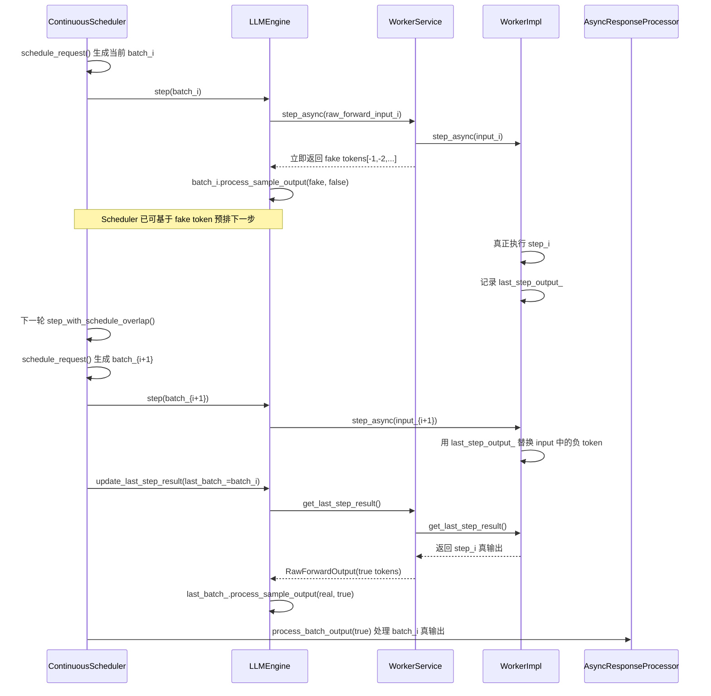

# xLLM `enable_schedule_overlap=true` 异步调度学习笔记

## 1. 这份笔记要回答什么

基于 `ralph/learn_xllm/0-overview.md` 和 `ralph/learn_xllm/1-structure.md` 已经建立的整体框架，我这次把 `enable_schedule_overlap=true` 这条异步调度链路单独拆开，重点回答下面这些问题：

1. 这个开关在启动阶段是怎么进入系统的，哪些场景会被内部强制关闭。
2. xLLM 所谓的 “schedule overlap / async schedule” 到底重叠了哪几段工作。
3. `ContinuousScheduler` 开启 overlap 后，`step()` 语义到底改成了什么。
4. fake token 是谁生成的、什么时候写进 `Sequence`、什么时候再被 true token 覆盖。
5. `Engine / WorkerService / WorkerImpl` 分别承担什么职责，线程和 future 是怎么配合的。
6. 为什么提前调度不会破坏正确性，尤其是 finish 判定、streaming 输出、usage 统计为什么还能成立。
7. 这套机制有哪些边界条件、限制和源码层面的不一致点。

---

## 2. 结论先行

先给出我当前最核心的结论：

1. `enable_schedule_overlap` 不是单纯让 `scheduler` 变成异步，而是把原本严格串行的 “CPU 组 batch -> device 计算 -> CPU 处理输出” 改造成“一步预调度、一步回收结果”的双阶段流水。
2. overlap 真正成立的关键不在 `Scheduler` 本身，而在 `WorkerService + WorkerImpl` 提供了一套“两份输出协议”：
   - 当前步立刻返回 fake token 给 `Engine/Scheduler` 用来预排下一步。
   - 真实模型输出先保存在 worker 内部，等下一轮再通过 `get_last_step_result()` 取回。
3. `ContinuousScheduler::step_with_schedule_overlap()` 的顺序不是“先收上一步结果再排下一步”，而是“先排当前批、先下发当前批，再回收上一批真结果”。这就是 overlap 的核心。
4. fake token 在标准 LLM/VLM 分布式执行路径里不是 `Batch` 自己生成的，而是 `WorkerService::step()` 在 `enable_schedule_overlap=true` 时主动伪造的 `[-1, -2, ...]` 占位 token。
5. `WorkerImpl::update_input_by_last_step_output()` 会在 step-i+1 真正执行前，把输入里的负数占位 token 替换成 step-i 的真实采样结果，所以调度看到的是 fake token，执行看到的是真 token。
6. 这套机制会让服务端多算一个 step，所以 embedding、REC、sample API、部分离线/子进程 worker 场景会被强制关掉；代码里也专门对 usage 统计、finish 判定、streaming 输出做了修正。
7. 文档、gflag、`Options` 三层关于默认值并不完全一致；此外文档说 VLM 暂时关闭 overlap，但当前核心 `VLMEngine/VLMMaster` 仍保留完整 overlap 实现，只是部分 Python API 会主动关掉它。

---

## 3. 阅读文件

这次为了把异步调度链路读透，我实际对过下面这些文件：

- `ralph/learn_xllm/0-overview.md`
- `ralph/learn_xllm/1-structure.md`
- `docs/zh/features/async_schedule.md`
- `docs/en/features/async_schedule.md`
- `docs/zh/cli_reference.md`
- `xllm/xllm.cpp`
- `xllm/core/common/global_flags.cpp`
- `xllm/core/common/options.h`
- `xllm/core/common/options.cpp`
- `xllm/core/distributed_runtime/master.cpp`
- `xllm/core/distributed_runtime/llm_master.cpp`
- `xllm/core/distributed_runtime/llm_engine.h`
- `xllm/core/distributed_runtime/llm_engine.cpp`
- `xllm/core/distributed_runtime/vlm_engine.cpp`
- `xllm/core/distributed_runtime/dist_manager.cpp`
- `xllm/core/distributed_runtime/remote_worker.cpp`
- `xllm/core/distributed_runtime/worker_server.cpp`
- `xllm/core/distributed_runtime/worker_service.cpp`
- `xllm/core/distributed_runtime/comm_channel.cpp`
- `xllm/core/distributed_runtime/spawn_worker_server/spawn_worker_server.cpp`
- `xllm/core/distributed_runtime/speculative_engine.cpp`
- `xllm/core/scheduler/continuous_scheduler.h`
- `xllm/core/scheduler/continuous_scheduler.cpp`
- `xllm/core/scheduler/async_response_processor.cpp`
- `xllm/core/scheduler/profile/profile_manager.h`
- `xllm/core/scheduler/profile/profile_manager.cpp`
- `xllm/core/scheduler/disagg_pd_scheduler.cpp`
- `xllm/core/scheduler/pd_ooc_scheduler.cpp`
- `xllm/core/runtime/options.h`
- `xllm/core/runtime/forward_params.h`
- `xllm/core/runtime/worker_client.h`
- `xllm/core/runtime/worker_client.cpp`
- `xllm/core/runtime/worker.h`
- `xllm/core/runtime/worker.cpp`
- `xllm/core/runtime/worker_impl.h`
- `xllm/core/runtime/worker_impl.cpp`
- `xllm/core/runtime/llm_worker_impl.cpp`
- `xllm/core/runtime/speculative_worker_impl.h`
- `xllm/core/runtime/speculative_worker_impl.cpp`
- `xllm/core/runtime/mtp_worker_impl.cpp`
- `xllm/core/runtime/forward_shared_memory_manager.cpp`
- `xllm/core/runtime/params_utils.cpp`
- `xllm/core/framework/batch/batch.h`
- `xllm/core/framework/batch/batch.cpp`
- `xllm/core/framework/batch/batch_input_builder.cpp`
- `xllm/core/framework/request/request.h`
- `xllm/core/framework/request/request.cpp`
- `xllm/core/framework/request/request_state.h`
- `xllm/core/framework/request/request_state.cpp`
- `xllm/core/framework/request/request_params.h`
- `xllm/core/framework/request/sequence.h`
- `xllm/core/framework/request/sequence.cpp`
- `xllm/core/framework/request/sequences_group.cpp`
- `xllm/core/framework/request/stopping_checker.cpp`
- `xllm/core/framework/sampling/sampler.cpp`
- `xllm/api_service/sample_service_impl.cpp`
- `xllm/api_service/sample_service_impl_test.cpp`
- `xllm/core/framework/batch/batch_test.cpp`
- `xllm/pybind/llm.py`
- `xllm/pybind/vlm.py`
- `xllm/pybind/embedding.py`

---

## 4. 先把开关路径定位清楚

### 4.1 从 CLI 到 `Options`

`enable_schedule_overlap` 的第一层来源是 gflag：

- `xllm/core/common/global_flags.cpp`
  - `DEFINE_bool(enable_schedule_overlap, false, "Whether to enable schedule overlap.");`

启动入口 `xllm/xllm.cpp` 会把这个 flag 原样灌进控制面 `Options`：

- `xllm/xllm.cpp`
  - `.enable_schedule_overlap(FLAGS_enable_schedule_overlap)`

然后 `Master` 再把它下沉到执行面 `runtime::Options`：

- `xllm/core/distributed_runtime/master.cpp`
  - `eng_options.enable_schedule_overlap(options_.enable_schedule_overlap())`

所以最基本的传播链是：

`gflags -> xllm::Options -> runtime::Options -> Master / Scheduler / Engine / Worker`

### 4.2 但它不是“用户传 true 就一定生效”

这个开关会在 `Master` 和若干服务入口里被二次修正：

1. `Master` 在 LLM embedding / mm_embed 场景强制关闭：
   - 原因：embedding 只做一次输出，多跑一个 step 会拖吞吐。

2. `Master` 在 REC 场景强制关闭：
   - 原因：当前不支持。

3. `Master` 在 `enable_disagg_pd=true` 且 `instance_role=PREFILL` 时强制关闭：
   - 原因：prefill 实例不走本地 decode 主循环，不适合预调度一步。

4. `spawn_worker_server.cpp` 构造子进程 worker 时显式设置：
   - `runner_options.enable_schedule_overlap(false);`
   - 同时 `FLAGS_enable_schedule_overlap = false;`

5. `/v1/sample` 接口直接拒绝：
   - `sample_service_impl.cpp` 里 `validate_runtime_config(true)` 返回 `UNAVAILABLE`。

6. Python 离线 API 也会主动关掉：
   - `xllm/pybind/llm.py`
   - `xllm/pybind/vlm.py`
   - `xllm/pybind/embedding.py`

### 4.3 默认值存在源码不一致

这里有一个必须明确记录的实现不一致：

1. `global_flags.cpp` 里 gflag 默认值是 `false`。
2. `xllm::Options` 和 `runtime::Options` 里字段默认值是 `true`。
3. `docs/zh/features/async_schedule.md` 和 `docs/en/features/async_schedule.md` 文档说默认是 `true`。
4. `docs/zh/cli_reference.md` 又把 CLI 默认值写成了 `false`。

我当前的判断是：

- 真正决定服务行为的是 gflag 默认值，也就是 CLI 启动路径默认 `false`。
- 文档和 `Options` 默认值更多像“能力默认值”或历史残留，不能直接当运行时事实。

---

## 5. xLLM 想重叠的到底是哪三段

官方文档的描述和源码是一致的：它想重叠的是一步 decode 中的三段工作：

1. CPU 侧调度与输入构造：
   - `Scheduler::prepare_batch()`
   - `BatchInputBuilder`
   - `Engine::prepare_inputs()`

2. device 侧真正 forward + sample：
   - `WorkerImpl::step()`
   - `Executor::forward()`
   - `Sampler::forward()`

3. CPU 侧输出处理与回调：
   - `Batch::process_sample_output()`
   - `Request/Sequence` 状态更新
   - `AsyncResponseProcessor`

不开 overlap 时，这三段是严格串行的：

`调度 step-i -> 执行 step-i -> 处理 step-i 输出 -> 再调度 step-i+1`

开 overlap 后，目标变成：

`下发 step-i -> 立刻用 fake token 预排 step-i+1 -> 另一路回收 step-i 真结果`

所以它重叠的不是“两次模型计算”，而是：

- step-i 的 device 计算
- 与 step-i+1 的 CPU 预调度
- 再加 step-i 的 CPU 输出处理

---

## 6. 整体时序：源码级的一轮 overlap 到底怎么跑

我把标准 LLM 路径的一轮 overlap 时序总结成下面这张图：

这张图里最关键的不是 “有 fake token”，而是这两个时序事实：

1. `Scheduler` 是先调当前批，再回收上一批。
2. `WorkerImpl` 是先把上一批真结果暂存起来，下一轮执行前再拿出来改写输入。

---

## 7. `ContinuousScheduler` 视角：step 语义被怎么改写

### 7.1 不开 overlap 时

`ContinuousScheduler::step()` 的普通路径很直接：

1. `schedule_request(timeout)` 得到 `batch`
2. `engine_->step(batch)` 执行当前 batch
3. `kv_cache_manager_->reset_transfer_infos()`
4. `process_batch_output(false)` 处理当前 batch 输出

这是一条标准串行链。

### 7.2 开 overlap 时

`ContinuousScheduler::step_with_schedule_overlap()` 把时序改成了：

1. `schedule_request(timeout)` 先拿到当前批 `batch`
2. 如果当前批不空，立即 `engine_->step(batch)`
3. 然后如果这不是第一步，并且 `last_batch_` 不空：
   - `engine_->update_last_step_result(last_batch_)`
   - `process_batch_output(true)`
4. 最后把：
   - `last_batch_ = std::move(batch)`
   - `last_running_sequences_ = running_sequences_`
   - `last_running_requests_ = running_requests_`

这里有三个非常关键的状态变量：

1. `last_batch_`
   - 记录“上一轮已经拿 fake token 预排出去，但真结果还没回收”的 batch。

2. `last_running_sequences_`
   - 记录上一轮真正应该在输出阶段被处理的 sequence 集合。

3. `is_first_step_`
   - 第一轮没有“更早的一步”可回收，所以只发 fake，不收真结果。

### 7.3 它保证最多只预调度一步

代码里有一句非常关键的注释：

- `producer-consumer mode, make sure only one step is scheduled in advance`

这意味着 xLLM 不是做深流水，而是严格的一步前视：

- 当前最多只允许 `batch_i` 先 fake 落地，再在下一轮把它改正。
- 不会出现 `batch_i`、`batch_{i+1}`、`batch_{i+2}` 连续三步都只靠 fake 向前冲。

这一点很重要，因为 `Sequence` 里与 fake token 相关的状态队列最多也只设计成承载 2 个有效元素。

---

## 8. `LLMEngine` 视角：为什么当前步能先拿到 fake 输出

### 8.1 `LLMEngine::step()` 实际拿的是 `RawForwardOutput`

`LLMEngine::step()` 做的事情是：

1. `prepare_inputs(batch)` 把每个 DP 微批转成 `RawForwardInput`
2. 对所有 `worker_clients_` 调 `step_async(raw_forward_inputs[dp_rank])`
3. `folly::collectAll(futures).get()` 等 RPC future 完成
4. 直接对返回的 `RawForwardOutput` 做：
   - `batch[dp_rank].process_sample_output(result.value(), false)`

重点在第 4 步：

- `process_sample_output(..., false)` 在 overlap 场景下并不是“处理真结果”，而是“把 fake token 先写进 sequence”。

### 8.2 `LLMEngine::update_last_step_result()` 才处理真输出

回收上一批真结果走的是另一条路径：

1. 只向 driver worker 拉取 `get_last_step_result_async()`
2. 组装成 `raw_forward_outputs`
3. 对 `last_batch[i]` 调：
   - `last_batch[i].process_sample_output(raw_forward_outputs[i], options_.enable_schedule_overlap())`

在 overlap 开启时，这里的第二个参数就是 `true`，含义是：

- 这一次不是 append fake token
- 而是把上一轮已经写进去的 fake token 替换成 true token

### 8.3 为什么只取 driver worker 的结果

注释写得很清楚：

- 除了 EPLB 特殊场景，driver worker 的 sample 输出就够了。
- TP 其他 worker 的输出在 sample 层面对 scheduler 来说是等价的。

所以 overlap 的“真结果回收”默认只从每个 DP 组的 driver 拉一次。

### 8.4 `prepare_inputs()` 为什么也很关键

`LLMEngine::prepare_inputs()` 虽然看起来只是数据整理，但它对 overlap 非常关键，因为它会调用：

- `batch[dp_rank].prepare_forward_input(args_, threadpool_.get())`

而 `BatchInputBuilder::setup_kv_cache_info()` 在构造本轮输入时，已经会先做：

- `sequence->kv_state().incr_kv_cache_tokens_num(q_seq_len);`

也就是说：

1. 本轮要写入多少 KV slot，在 batch 构造阶段就先推进了 `kv_cache_tokens_num`
2. 等 fake token 也 append 到 `Sequence` 之后，下一轮 scheduler 已经能把它当成“逻辑上向前走了一步”的 decode 序列继续调度

这也是 overlap 能真正“预调度下一步”的前提。

---

## 9. `WorkerService` 视角：fake token 到底是谁造的

### 9.1 标准 LLM/VLM 路径里，fake token 是 `WorkerService` 伪造的

`WorkerService::step()` 的逻辑分成两条：

1. 如果 `!options_.enable_schedule_overlap()`：
   - 等 `worker_->step_async()` 完成
   - 把真实 `next_tokens/logprobs/...` 拷回 CPU
   - 返回给 engine

2. 如果 `options_.enable_schedule_overlap()`：
   - 不等待真实结果
   - 如果当前 worker 是 driver：
     - 构造 `next_tokens = [-1, -2, ..., -num_decode_seqs]`
   - 对真实 future 只做 `deferValue( {})`
   - 立即返回 fake output

这里 `num_decode_seqs = fwd_input.sampling_params.sample_idxes.size(0)`，所以负 token 的个数严格对应当前需要 sample 的 decode 序列个数。

### 9.2 为什么 fake token 设计成 `-1, -2, ...`

这不是随便找个负数，而是编码了“当前 sample 顺序”：

1. 第一个 decode 序列先拿到 `-1`
2. 第二个 decode 序列拿到 `-2`
3. 第 N 个 decode 序列拿到 `-N`

稍后 `WorkerImpl::update_input_by_last_step_output()` 会把负数的绝对值减 1，当成下标去索引上一轮真实 `next_tokens`：

- `-1 -> index 0`
- `-2 -> index 1`
- `-3 -> index 2`

所以 fake token 其实是一个“延迟绑定的 sample 索引占位符”。

### 9.3 这解释了 `Batch::process_sample_output(false)` 的注释

之前看 `LLMEngine::step()` 里的注释会觉得奇怪：

- 为什么传了 `replace_fake_token=false`，还能 append fake token？

真正原因不是 `Batch` 自己知道要造 fake，而是：

- `WorkerService` 返回的 `RawForwardOutput` 本身就是 fake token
- `Batch::process_sample_output(false)` 只是把“当前拿到的 token”按普通 append 语义写进去

所以这里的 fake 语义来自 worker service，不来自 batch。

---

## 10. `WorkerImpl` 视角：真结果是怎么暂存和替换的

### 10.1 `WorkerImpl` 有一套专门为 overlap 设计的状态

`WorkerImpl` 里专门有这些成员：

- `ForwardOutput last_step_output_`
- `bool last_step_output_valid_`
- `std::mutex mtx_`
- `std::condition_variable cv_`
- `bool is_recorded_`

以及一个重要约束：

- `threadpool_` 明确要求只有 1 个工作线程

注释写得非常清楚：

- 开 overlap 时可能会有两个 step 任务同时被分发到队列里，但 step 必须一个接一个执行。

也就是说：

- xLLM 要重叠的是 “CPU 调度/输出处理” 与 “device 计算”
- 不是让同一个 worker 并发执行两个真正的 model step

### 10.2 `step_async()` 在 overlap 场景下做了两件额外的事

`WorkerImpl::step_async()` 的 overlap 分支核心逻辑是：

1. 如果已经有 `last_step_output_valid_`，并且当前输入里含 decode token：
   - 先 `update_input_by_last_step_output(input)`
   - 把输入里的负 token 替换成上一轮真实 token

2. 调用 `this->step(input)` 真正执行当前步

3. 执行完成后，如果有有效输出：
   - `update_last_step_output(output)`
   - 设置 `is_recorded_ = true`
   - `cv_.notify_one()`

所以它既负责：

- 在 step-i+1 开始前用 step-i 真结果修补输入

也负责：

- 把 step-i 的真输出录到 `last_step_output_`，供下一轮 engine 拉取

### 10.3 输入替换是怎么做的

`WorkerImpl::update_input_by_last_step_output()` 的核心逻辑是：

1. 找到 `inputs.token_ids` 里所有 `< 0` 的位置
2. 取负号后减 1，变成上一轮 `next_tokens` 的索引
3. 用 `torch::where` 把这些负 token 替换成 `last_step_output_.sample_output.next_tokens`

如果上一轮真实输出是：

- `[101, 202, 303]`

当前输入里对应位置是：

- `[-1, -2, -3]`

那么替换后就变成：

- `[101, 202, 303]`

这就是 “调度看到 fake，占位推进；执行前再恢复真值” 的真正落地点。

### 10.4 真输出回收为什么要用条件变量

`WorkerImpl::get_last_step_result()` 会：

1. `cv_.wait(lock, [this] { return is_recorded_; });`
2. 取出 `last_step_output_`
3. 把 `is_recorded_ = false`
4. `cv_.notify_one()`

而 `step_async()` 在写入结果前也会：

1. `cv_.wait(lock, [this] { return !is_recorded_; });`
2. 再写 `last_step_output_`

所以这里其实是一个标准的单槽 producer-consumer：

- producer: 当前 step 执行线程
- consumer: 下一轮 `get_last_step_result()`

这正好对应 scheduler 那边“最多只允许预调度一步”。

---

## 11. `Batch / Sequence / Request` 视角：为什么 fake token 不会破坏正确性

### 11.1 `Batch` 的两阶段输出处理语义

`Batch::process_sample_output(..., replace_fake_token)` 的设计就是为 overlap 准备的：

1. `replace_fake_token=false`
   - 当前阶段只是把返回 token 写进序列
   - 在 overlap 标准路径下，这里写进去的是 fake token

2. `replace_fake_token=true`
   - 当前阶段不再 append
   - 而是调用 `Sequence::update_last_step_token()` 把上一轮 fake token 改成真 token

单测 `BatchTest.KeepTargetsForOverlapReplacement` 也明确验证了这件事：

1. 先喂一个 `-1`
2. 断言序列里确实先看到 `-1`
3. 再喂一个 `101` 且 `replace_fake_token=true`
4. 断言原位置被替换成 `101`

### 11.2 fake token append 后，`Sequence` 会故意跳过部分逻辑

`Sequence::append_token()` 在 overlap 模式下，如果 `token_id < 0`：

1. 仍然会推进 `num_tokens_`
2. 仍然会推进 `kv_state_` 相关长度
3. 但不会更新重复惩罚计数
4. 不会写 logprob
5. 只把 `finish_status_invalidated_ = true`

这等于告诉系统：

- “这个位置已经被占了，方便下一轮调度”
- “但它还不是一个真实完成的生成 token，不能参与 finish/logprob 等语义”

### 11.3 finish 判定专门忽略负 token

`StoppingChecker::check()` 和 `Sequence::generate_streaming_output()/generate_output()` 都有一套相同的修正：

1. 从尾部往前扫
2. 找最后一个 `>= 0` 的 token
3. 用这个 token 做 finish reason 判断或最终输出

因此 fake token 不会导致：

1. EOS 被错误触发
2. stop token / stop sequence 被错误命中
3. 客户端提前看到 `-1`

### 11.4 usage 统计也要减掉那一步

因为 overlap 会在服务端额外多推进一个 fake step，`Request::generate_output()` 和 `Request::log_statistic()` 都做了修正：

- 如果 `enable_schedule_overlap=true`
- `generated_tokens` 要减 1

否则统计会把那一步额外执行也算进 completion token 数里。

### 11.5 为什么 `LLMMaster` 会多预留一段容量

`LLMMaster::generate_request()` 在计算 `seq_capacity` 时，若 overlap 开启，会额外：

- `capacity += options_.num_speculative_tokens() + 1;`

这说明作者在 request/sequence 容量层面已经预留了：

- 一个“当前逻辑 token”
- 再加 overlap 额外占出来的一步空间

这也是为什么 fake token 先写进去不会立刻把 sequence 容量打爆。

---

## 12. 响应处理层：为什么客户端不会看到乱序或丢 token

### 12.1 overlap 模式下，输出处理针对的是 `last_running_*`

`ContinuousScheduler::process_batch_output(true)` 不处理当前 `running_requests_`，而是处理：

- `last_running_sequences_`
- `last_running_requests_`

原因很直接：

- 当前 `running_*` 已经被 fake token 推到下一步状态了
- 真正该向客户端输出的是“上一轮刚刚被修正成真 token 的那批请求”

### 12.2 streaming 场景为什么要补 `handle_last_token()`

在 overlap 模式下，如果请求刚在上一轮真结果回收时完成，代码会额外检查：

1. 如果是 stream request
2. 已 finished
3. 但 `last_token_handled()` 还没置位

则先：

- `request->handle_last_token()`

再把请求送进 `response_processor_`

这一步很重要，因为 overlap 下“完成请求”和“真正把最后一个 token 对外输出”不再发生在同一个 step 的同一个时刻，必须显式补这一下，避免最后一个 token 被 finish 直接吞掉。

### 12.3 非 stream 场景也会补最后一个 token

对于非 stream 请求，若：

- `request->finished() && !request->last_token_handled()`

也会先 `handle_last_token()` 再生成最终输出。

所以 overlap 并不会让最终完整输出少最后一个 token，只是把“输出生效时间”从当前步挪到了下一轮回收阶段。

---

## 13. 线程模型：真正重叠的是哪些线程

把源码拼起来后，我认为这套机制至少涉及 5 组线程：

1. `LLMMaster::run()` 的 scheduler loop thread
   - 不停调用 `scheduler_->step(timeout)`

2. request handling thread pool
   - `LLMMaster` 把用户请求转成 `Request`

3. response handling thread pool
   - `AsyncResponseProcessor`
   - 负责 stream/non-stream 回调

4. `WorkerService` 自己的 RPC 线程池
   - 负责立即回复 fake output
   - 或下一轮回复真 output

5. `WorkerImpl` 内部单线程 threadpool
   - 串行执行真正的 model step

所以 overlap 的真实并发关系是：

1. scheduler loop 线程在当前步 fake 回来后立刻继续调度下一步
2. worker 内部单线程还在后台跑当前步真计算
3. response 线程池再异步处理上一轮真输出

这和文档里说的“CPU 阶段 1 和 3 采用不同线程池、RPC 用 future/promise 非阻塞调用”是对得上的。

---

## 14. 为什么它能让下一轮调度提前发生

我把 overlap 真正成立的条件总结成下面 4 个必要条件：

1. 当前 step 发出去以后，master 侧必须马上拿到一个“可继续推进状态”的返回值。
   - 这由 `WorkerService::step()` 的 fake token 提供。

2. 这个返回值必须足够让 `Sequence` 向前走一格。
   - 这由 `Batch::process_sample_output(false)` 完成。

3. 下一轮真正执行前，fake token 又必须能被真 token 替换回来。
   - 这由 `WorkerImpl::update_input_by_last_step_output()` 完成。

4. finish / output / usage 必须以真 token 为准，而不是 fake token。
   - 这由 `StoppingChecker`、`Sequence`、`Request`、`process_batch_output(true)` 一系列修正共同完成。

只要这 4 条缺一条，这套机制就会出错。

所以我现在更愿意把 overlap 理解成：

> 一套“先推进逻辑状态、后补真实语义”的双阶段提交协议。

这比单纯说“异步调度”更接近源码实际语义。

---

## 15. 特殊场景和变体

### 15.1 Disagg PD / PD OOC 也会手动补 fake token

`disagg_pd_scheduler.cpp` 和 `pd_ooc_scheduler.cpp` 在接收远端迁移 token 时，如果 overlap 开启，也会手工做：

1. `append_token(Token(-1))`
2. `update_last_step_token(real_token)`

这说明：

- overlap 的“fake 再 replace”语义并不只存在于标准 LLMEngine 路径
- 在 PD 分离场景里，只要本地没有走标准 worker fake-output 协议，也会手工补同样的状态变换

### 15.2 profiling 也会显式把回收阶段算进去

`ProfileManager::run_request()` 在 overlap 开启时会：

1. `engine_->step(batches)`
2. 再额外 `engine_->update_last_step_result(batches)`

这说明 profile 侧也知道：

- 只测 `step()` 不够
- overlap 的完整成本必须把“上一轮真结果回收”算进去

### 15.3 speculative 路径是一个边界特例

`SpeculativeEngine` 仍然把 `update_last_step_result()` 代理给内部 `LLMEngine`，所以外层 schedule overlap 语义还在。

但 `MTPWorkerImpl` / `SpeculativeWorkerImpl` 又做了额外处理：

1. 内部 target/draft `LLMWorkerImpl` 会被构造成 `enable_schedule_overlap(false)`
2. 外层 speculative worker 自己覆写了 `update_input_by_last_step_output()`

这说明：

- speculative 场景没有直接复用普通 LLM worker 的 overlap 输入替换逻辑
- 而是自己做了一层特化

所以如果后续要继续深挖 overlap，我会把：

- 标准 LLM overlap
- speculative overlap

分成两条子线，不建议混在一起讲。

---

## 16. 当前确认的限制条件

### 16.1 明确不建议或不支持的场景

当前源码和文档共同表明，下面这些场景不适合 overlap：

1. embedding / mm_embed
   - `Master` 强制关闭

2. REC
   - `Master` 强制关闭

3. `/v1/sample`
   - service 层直接拒绝

4. spawn worker 离线路径
   - 子进程 worker 直接关掉

5. 部分 Python 离线 API
   - 主动设成 `False`

### 16.2 文档与实现的一个灰区：VLM

文档里写：

- “VLM 正在适配中，暂时会强制关闭异步调度”

但我这次对到的源码事实是：

1. `VLMEngine` 仍保留完整的 overlap 实现
2. `VLMMaster` 也把 `enable_schedule_overlap` 传给 scheduler
3. Python `vlm.py` 会主动把 `options.enable_schedule_overlap = False`
4. `Master` 构造 `VLMEngine` 的分支里没有像 embedding/REC 那样显式强制关闭

所以我目前的保守结论是：

- “VLM 核心执行链具备 overlap 代码，但对外接口层面仍倾向默认关闭”
- 这是一处实现与文档尚未完全收敛的灰区

---

## 17. 我认为最重要的源码观察

### 17.1 overlap 的关键不在 `Scheduler`，而在“跨轮结果协议”

如果只看 `ContinuousScheduler::step_with_schedule_overlap()`，很容易误以为它只是把 `engine_->update_last_step_result()` 往后挪了一下。

但真正让这件事成立的是整套跨轮协议：

1. `WorkerService` 当轮返回 fake output
2. `WorkerImpl` 后台保存真 output
3. 下一轮执行前 `WorkerImpl` 用真 output 修补输入
4. 下一轮 scheduler 再回收上一轮真结果

没有这套协议，`Scheduler` 单独改顺序是没有意义的。

### 17.2 这不是“无状态预调度”，而是“带状态的预提交”

overlap 之所以复杂，是因为它不是纯粹把“下一轮 batch 先算出来”而已，而是已经真实修改了：

1. `Sequence::tokens_`
2. `Sequence::num_tokens_`
3. `Sequence::kv_state().kv_cache_tokens_num()`
4. request 是否进入下一轮 decode 的资格

只是这些修改里有一部分是 provisional 的，需要下一轮再修正。

所以它更像数据库里的：

- 先预提交逻辑状态
- 再异步补真实值

### 17.3 为了效率，它接受了“服务端多算一步”的代价

文档里这句话是很准确的：

- overlap 会让服务端额外计算一个 step

这句话在源码里有多处佐证：

1. `Request::generate_output()` 要减 1 个 generated token
2. `Request::log_statistic()` 要减 1
3. `LLMMaster::generate_request()` 要额外预留 capacity
4. sample/embedding/REC 等场景直接把它关掉

所以它本质上是用：

- 额外一步服务端工作

换：

- 更高的 device 利用率
- 更低的 step 间空泡

---

## 18. 当前我记录下来的不一致点 / 开放问题

### 18.1 默认值不一致

如前面所说：

1. gflag 默认 `false`
2. `Options` 默认 `true`
3. 文档有的写 `true`，有的写 `false`

这一点如果后面要写总览文档，必须明确以“真实启动入口”为准。

### 18.2 `LLMMaster::generate()` 的断言提示语看起来反了

`LLMMaster::generate()` 里有：

- `DCHECK(options_.enable_schedule_overlap()) << "Mode generate does not support schedule overlap yet.";`

从字面上看：

- 条件要求 overlap 为真
- 但报错信息却说 generate 模式不支持 overlap

这更像是一处提示语或断言条件尚未收敛的残留。

### 18.3 VLM overlap 状态没有完全收敛

这一点上面已经单独说过，不再重复。

---

## 19. 最后把整条链压缩成一句话

如果让我现在用一句话概括 `enable_schedule_overlap=true` 的源码逻辑，我会这样说：

> xLLM 的异步调度并不是让 scheduler 单独异步化，而是让 worker 先返回一份 fake token 占位结果，scheduler 基于这份占位结果把下一步 batch 提前排好；与此同时，worker 在后台算出上一步真结果，并在下一轮执行前把输入中的负占位 token 替换成真 token，最后再由 engine/scheduler 回收上一轮真实输出并返回给客户端。

这条链一旦抓住，后面的 `Sequence`、`Batch`、`Request`、`AsyncResponseProcessor`、`ProfileManager`、`PD` 变体就都能对上了。

