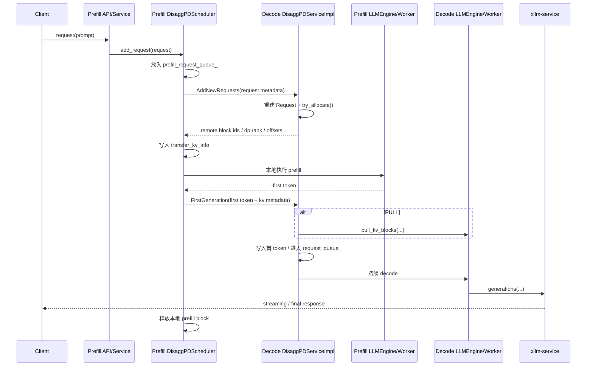

# xLLM PD 分离（Prefill / Decode Disaggregation）源码学习笔记

## 1. 这份笔记要回答什么

基于 `ralph/learn_xllm/0-overview.md` 和 `ralph/learn_xllm/1-structure.md` 已经建立的整体框架，我这次把 xLLM 里的 PD 分离单独拆开，重点回答下面这些问题：

1. `enable_disagg_pd` 打开后，系统到底切换了哪些路径，而不是只“多了一个开关”。
2. Prefill 实例和 Decode 实例各自负责什么，谁接请求，谁分配 KV block，谁继续 decode。
3. `DisaggPDScheduler` 相比普通 `ContinuousScheduler` 额外做了哪些事。
4. Prefill 请求是怎样先在 Decode 侧占好块、再回到 Prefill 侧执行 prefill、最后把首 token 和 KV 交给 Decode 的。
5. KV 传输里的 `PUSH` / `PULL` 两种模式分别是怎么接进执行链的。
6. PD 分离为什么会强依赖 `xllm-service`、service routing、instance registration。
7. 这条链路和 schedule overlap、prefix cache、chunked prefill 之间是什么关系，源码和文档有没有不一致。

---

## 2. 结论先行

先给出我当前最核心的结论：

1. xLLM 的 PD 分离不是“一个调度器特性”，而是四层协作的结果：
   - 启动/配置层：`xllm.cpp -> Options -> Master -> runtime::Options`
   - 调度层：`scheduler_factory -> DisaggPDScheduler`
   - 服务与发现层：`DisaggPDService + XServiceClient + xllm-service + etcd`
   - 执行与数据面：`LLMEngine -> WorkerClient -> WorkerImpl -> KVCacheTransfer`
2. 在 PD 模式下，请求不会像普通 continuous batching 那样直接进本地 waiting queue。Prefill 实例会先把请求元信息发给 Decode 实例，让 Decode 先做“远端 block 预分配”，然后 Prefill 才真正开始本地 prefill。
3. PD 交接不是一步，而是两个阶段：
   - 阶段 A：`AddNewRequests`，Prefill 把请求骨架发给 Decode，Decode 分配远端 block 并返回 block id / dp rank / xTensor 偏移等信息。
   - 阶段 B：`FirstGeneration`，Prefill 跑完 prefill 拿到首 token 后，把首 token 和必要的 KV 传输信息交给 Decode，Decode 才把请求正式推进到 decode 主循环。
4. Prefill 和 Decode 的职责划分非常明确：
   - Prefill 负责接用户请求、执行 prompt prefill、生成首 token、在合适时机释放本地 KV block。
   - Decode 负责为后续生成保留远端 block、接住首 token、必要时拉取 KV、再持续 decode。
5. `PUSH` 和 `PULL` 的差异不在“有没有 KV 传输”，而在“KV 是在 Prefill forward 过程中主动推过去，还是在 Decode 收到首 token 后再主动拉过来”。
6. PD 模式会强制打开 service routing；同时，`instance_role=PREFILL` 时 schedule overlap 会被强制关闭。这说明在 xLLM 的设计里，PD 分离不是一个纯本地优化，而是和服务路由、实例发现、跨实例回流强绑定的。
7. 文档明确写了 PD 当前不支持 prefix cache 和 chunked prefill，但源码里并没有一个非常强硬的全局启动校验把这些组合完全禁掉。这意味着当前应以文档约束为准，同时把“代码路径仍有共存痕迹”视为实现边界和风险点。

---

## 3. 阅读文件

这次为了把 PD 分离的逻辑读透，我实际对过下面这些文件：

- `ralph/learn_xllm/0-overview.md`
- `ralph/learn_xllm/1-structure.md`
- `ralph/learn_xllm/3-schedule_overlap.md`
- `docs/zh/features/disagg_pd.md`
- `docs/zh/getting_started/disagg_pd.md`
- `docs/zh/features/prefix_cache.md`
- `xllm/xllm.cpp`
- `xllm/core/common/global_flags.cpp`
- `xllm/core/common/options.h`
- `xllm/core/runtime/options.h`
- `xllm/core/common/types.h`
- `xllm/core/distributed_runtime/master.cpp`
- `xllm/core/distributed_runtime/llm_master.cpp`
- `xllm/core/distributed_runtime/disagg_pd_service.h`
- `xllm/core/distributed_runtime/disagg_pd_service.cpp`
- `xllm/core/distributed_runtime/disagg_pd_service_impl.h`
- `xllm/core/distributed_runtime/disagg_pd_service_impl.cpp`
- `xllm/core/distributed_runtime/llm_engine.h`
- `xllm/core/distributed_runtime/llm_engine.cpp`
- `xllm/core/distributed_runtime/worker_service.cpp`
- `xllm/core/distributed_runtime/remote_worker.cpp`
- `xllm/core/runtime/worker_client.h`
- `xllm/core/runtime/worker_impl.h`
- `xllm/core/runtime/worker_impl.cpp`
- `xllm/core/runtime/llm_worker_impl.cpp`
- `xllm/core/runtime/xservice_client.h`
- `xllm/core/runtime/xservice_client.cpp`
- `xllm/core/scheduler/scheduler_factory.cpp`
- `xllm/core/scheduler/continuous_scheduler.h`
- `xllm/core/scheduler/continuous_scheduler.cpp`
- `xllm/core/scheduler/disagg_pd_scheduler.h`
- `xllm/core/scheduler/disagg_pd_scheduler.cpp`
- `xllm/core/scheduler/async_response_processor.cpp`
- `xllm/core/framework/batch/batch_input_builder.cpp`
- `xllm/core/framework/request/request_params.h`
- `xllm/core/framework/request/request_state.h`
- `xllm/core/framework/request/request_state.cpp`
- `xllm/core/framework/request/request_output.h`
- `xllm/core/framework/request/request.cpp`
- `xllm/core/framework/request/sequence_kv_state.h`
- `xllm/core/framework/request/sequence_kv_state.cpp`
- `xllm/core/framework/request/incremental_decoder.h`
- `xllm/core/framework/request/incremental_decoder.cpp`
- `xllm/core/framework/kv_cache/kv_cache_transfer.h`
- `xllm/core/framework/kv_cache/kv_cache_transfer.cpp`
- `xllm/core/framework/kv_cache/llm_data_dist_transfer.h`
- `xllm/core/framework/kv_cache/llm_data_dist_transfer.cpp`
- `xllm/api_service/chat_service_impl.cpp`
- `xllm/api_service/completion_service_impl.cpp`
- `xllm/proto/disagg_pd.proto`

---

## 4. 先把系统角色分清楚

如果只看“PD 分离”这个名字，很容易误以为它只是把 prefill 和 decode 放到两台机器上。但结合源码看，xLLM 里的 PD 分离至少涉及 5 个角色：

### 4.1 Prefill 实例

- 对外接收请求的入口通常在这里。
- 它持有 `DisaggPDScheduler`，但新请求不会直接进入本地 decode waiting queue。
- 它负责：
  - 接住用户请求；
  - 把请求骨架发给 Decode 实例；
  - 本地执行 prefill；
  - 生成首 token；
  - 触发首 token 交接；
  - 释放本地 prefill 阶段使用过的 block。

### 4.2 Decode 实例

- 它不是初始请求入口，但会在 PD 链路里成为“后半程执行者”。
- 它负责：
  - 接收 Prefill 发来的请求骨架；
  - 预分配 decode 侧 block；
  - 接住首 token；
  - 在 `PULL` 模式下主动拉取 KV；
  - 让请求进入本地 decode 调度主循环。

### 4.3 `DisaggPDScheduler`

- 它不是从零写的新调度器，而是 `ContinuousScheduler` 的变体。
- 核心新增职责是：
  - 维护 Prefill 侧待分发请求队列；
  - 启动 PD 内部 RPC server；
  - 和远端 Decode 实例做请求骨架/首 token 交接；
  - 在请求状态里记录 decode 地址、远端 block 信息、KV 传输参数；
  - 控制“什么时候本地执行 prefill，什么时候把请求真正交给 Decode”。

### 4.4 `xllm-service` / service routing

- 从源码上看，PD 模式会强制开启 service routing。
- `LLMMaster` 在 service routing 开启时会初始化 `XServiceClient`。
- `DisaggPDScheduler` 启动后会把本实例信息注册出去，包含：
  - 实例名；
  - RPC 地址；
  - 实例类型；
  - cache 信息；
  - 设备 IP / 传输端口；
  - DP 大小；
  - 可选的 xTensor page 信息。
- 这意味着 PD 分离依赖一个“外部实例发现/调度”平面；Prefill 不是凭空知道 Decode 在哪，而是和 xllm-service / etcd 这套体系协同。

### 4.5 etcd

- 文档与 `XServiceClient` 的使用方式表明，实例发现和状态注册会依赖 etcd。
- 这部分外部系统行为不完全在本仓库内，因此我只把它记录为“源码明确依赖的外部控制面”，不去过度推断它内部实现。

---

## 5. 配置与启动链：PD 模式是怎样被打开的

### 5.1 从 gflags 到 `Options`

PD 分离的关键开关和参数在启动入口被读入：

- `enable_disagg_pd`
- `instance_role`
- `kv_cache_transfer_mode`
- `transfer_listen_port`
- `etcd_addr`

这些 flag 在 `xllm/xllm.cpp` 中进入 `xllm::Options`，之后再由 `Master` 下沉到 `runtime::Options`。

我认为这里最重要的不是“有这些字段”，而是两个派生行为：

1. `xllm/xllm.cpp` 会把 `enable_service_routing` 设为 `FLAGS_enable_service_routing || FLAGS_enable_disagg_pd`。
2. `Master` 在看到 `enable_disagg_pd` 后，又会再次强制 `options_.enable_service_routing(true)`。

这说明 PD 分离在控制面上的真实语义是：

`enable_disagg_pd = true` 不只是开 PD，本质上还隐式要求系统进入 service-routed 运行方式。

### 5.2 `Master` 对 PD 的二次修正

`xllm/core/distributed_runtime/master.cpp` 里还有两个关键修正：

1. `enable_disagg_pd` 时，强制打开 service routing。
2. 如果 `instance_role == PREFILL`，则强制关闭 `enable_schedule_overlap`。

第二条非常关键。它说明 Prefill 节点在 PD 模式下不再适合跑“本地 decode 主循环预调度一步”这套逻辑，因为它的职责只到“prefill + 首 token 交接”为止。

### 5.3 `runtime::Options` 才是执行面真正消费的 PD 快照

`Master` 会把下面这些信息下沉到 `runtime::Options`：

- `enable_disagg_pd`
- `instance_role`
- `kv_cache_transfer_mode`
- `transfer_listen_port`
- 其他执行面实际需要的分布式/缓存/调度参数

因此从执行面的角度看，PD 不是靠全局 flag 临时读取，而是靠 `runtime::Options` 这个快照驱动 `Engine / Worker / KV transfer` 行为。

---

## 6. 调度器选择：为什么最后会落到 `DisaggPDScheduler`

`xllm/core/scheduler/scheduler_factory.cpp` 的选择逻辑很直接：

1. 普通场景走 `ContinuousScheduler` 或其它变体。
2. 如果 `options.enable_disagg_pd()` 为真，则优先选择 `DisaggPDScheduler`。
3. 只有在 `enable_pd_ooc()` 打开时才会切到 `PDOOCScheduler`。

这说明 PD 分离在 xLLM 的实现里，核心仍然建立在 continuous batching 的调度骨架之上，而不是重写一套全新 scheduler。

换句话说，`DisaggPDScheduler` 的设计思想是：

- 保留 continuous scheduler 的请求状态机、batch 组织能力、正常 decode 推进逻辑；
- 只在“请求进入系统”和“prefill/decode 交接”这两个关键点插入跨实例控制。

---

## 7. `DisaggPDScheduler` 构造阶段到底做了什么

结合 `disagg_pd_scheduler.cpp` 看，构造函数本身就已经把很多 PD 特有机制拉起来了。

### 7.1 启动 Prefill 分发线程

调度器会创建专门线程处理 Prefill 侧请求分发。它的职责不是执行模型，而是不断把新请求送到 Decode 侧做预分配。

这意味着在 PD 模式下，请求入口和请求真正进入本地 prefill 执行之间，多了一层“异步分发并等待远端确认”的缓冲。

### 7.2 启动 PD 内部 RPC server

`DisaggPDScheduler` 会自己拉起一个 RPC server，用于处理：

- `AddNewRequests`
- `FirstGeneration`
- 其他 PD 内部交互

这套 server 和对外 API server 不是同一个层次：

- 对外 API server 是 `xllm.cpp` / `XllmServer` 启动的服务入口；
- PD RPC server 是 scheduler 内部为了 Prefill/Decode 交接而拉起的实例间通信端点。

### 7.3 绑定 `XServiceClient`

RPC server 初始化好之后，调度器会绑定 `XServiceClient`，用于和 xllm-service 侧进行实例发现与信息登记。

### 7.4 注册实例信息

调度器会向外登记当前实例的能力信息。我确认至少包含：

- 实例名；
- RPC 地址；
- 实例角色/类型；
- cache 信息；
- 设备侧网络地址与端口；
- DP 大小；
- 可选的 xTensor page 相关信息。

这个步骤非常重要，因为 PD 分离能不能工作，不只取决于本实例是否支持，还取决于别的实例能不能找到你、知道你的 cache 能力和网络传输信息。

### 7.5 MIX 角色的 profile 初始化

源码里还可以看到 MIX 角色会触发 TTFT/TPOT profile 初始化。这说明 PD 体系还考虑了混部/混合角色场景，不只是纯 Prefill 或纯 Decode。

---

## 8. 实例角色：PREFILL / DECODE / MIX 到底意味着什么

`xllm/core/common/types.h` 定义了 `InstanceRole`，我在这次阅读里主要关注这几个值：

- `DEFAULT`
- `PREFILL`
- `DECODE`
- `MIX`

我的理解是：

### 8.1 `PREFILL`

- 这个实例承担请求入口和 prefill 前半程。
- 新请求会先进入 `prefill_request_queue_`，而不是直接变成本地 decode 调度对象。
- 它最终会把请求交接给 Decode。

### 8.2 `DECODE`

- 这个实例负责接手 Prefill 已经跑出首 token 的请求。
- 它会先预分配 block，再等待首 token 和必要的 KV。
- 一旦交接完成，请求就回到普通 decode 主循环。

### 8.3 `MIX`

- 从代码看是同时具备两种能力的角色。
- 它和外部调度/路由的具体协作策略不完全在当前仓库内，我不对调度策略细节做过度推断，只确认它在实例注册和 profile 管理上有专门支持。

---

## 9. Prefill 侧完整时序

这一段是我认为最关键的一段，因为 PD 分离真正改变的就是请求进入系统之后的前半程。

### 9.1 `add_request()` 不再直接把请求塞进普通 waiting queue

普通 continuous scheduler 的直觉是：请求到了，本地排队，等预算合适时进 batch。

但在 `DisaggPDScheduler::add_request()` 里不是这样。Prefill 侧会把请求放进：

- `prefill_request_queue_`
- 或对应的 offline queue

这一步说明新请求只是“登记为待分发”，还没有进入真正的 prefill 执行主链。

### 9.2 分发线程挑出请求并发起 `AddNewRequests`

分发线程会把请求元信息序列化后，调用 Decode 侧 RPC。

这里传过去的不是一个“已经执行过 prefill 的请求”，而是一份请求骨架，包含：

- request id
- service request id
- source xservice 地址
- prompt / prompt tokens
- sampling 参数
- stopping 参数
- SLO / streaming 元信息
- Prefill 集群和设备信息

所以 `AddNewRequests` 的真实语义不是“开始 decode”，而是“请你先以 decode 视角为这个请求预留资源”。

### 9.3 Decode 返回远端分配结果

如果 Decode 侧预分配成功，它会返回至少这些内容：

- 远端分配好的 block ids
- 远端 dp rank
- 可选的 xTensor 偏移信息

Prefill 侧随后会把这些信息写入请求里每个 sequence 的 `kv_state.transfer_kv_info`。

这一步非常关键，因为之后无论 `PUSH` 还是 `PULL`，都需要知道“我要把哪个本地 block 的 KV 对应到远端哪个 block / 哪个 rank”。

### 9.4 只有拿到远端信息后，Prefill 才把请求推进本地执行

我把这一点视为 PD 分离的核心设计：Prefill 不会在对方尚未为后续 decode 预留资源时就贸然开始执行 prompt。

这样做的好处是，一旦 prefill 完成，后续交接所需的远端落点已经明确，避免首 token 出来后再临时找 Decode 资源。

### 9.5 Prefill 正常跑 prompt，并得到首 token

一旦请求被真正推进本地执行，它在 Prefill 侧的 batch / engine / worker 路径仍然是 xLLM 原有主链：

`Scheduler -> Batch -> LLMEngine -> WorkerClient -> WorkerImpl`

只是这个阶段更像“只跑到首 token 为止”的 prefill 半程，而不是完整 decode 生命周期。

### 9.6 Prefill 通过 `FirstGeneration` 交接首 token

当 Prefill 侧拿到首 token 后，会触发第二阶段 RPC：`FirstGeneration`。

这一步发送的不只是 token 本身，还会带上：

- 首 token
- logprob / top tokens
- TTFT
- 在 `PULL` 模式下所需的 KV 拉取元信息

这说明“PD 交接点”在 xLLM 里被定义为：

首 token 已经确定，但完整 decode 主循环还没有在 Prefill 侧展开。

### 9.7 Prefill 释放本地 block

首 token 成功交接后，Prefill 会释放自己本地为该请求持有的 block。

这一步是 PD 分离真正产生显存收益的关键。否则即使逻辑上分了 Prefill/Decode，两边仍同时保留一份完整 KV，就失去意义了。

---

## 10. Decode 侧完整时序

Prefill 侧看到的是“先分发，再 prefill，再交接”。Decode 侧看到的则是“先预留，再等待，再接管”。

### 10.1 `decode_recv_new_requests()` 重建请求对象

`DisaggPDServiceImpl::decode_recv_new_requests()` 收到 `AddNewRequests` 后，会基于 RPC 里的信息重新构造 `Request`。

这里的请求不是为了立即执行，而是为了让 Decode 侧拥有一份本地运行时对象，能接住后面的 block 分配和首 token 交接。

### 10.2 Decode 先做 block 分配

Decode 侧会调用 `scheduler_->try_allocate(sequence)` 之类的逻辑，为 sequence 预先分配 decode 侧 block。

如果分配失败，请求不会进入后续链路；Prefill 侧也就不会继续推进本地 prefill。

所以 PD 链路实际上把“后半程资源是否可用”的检查前移到了 prompt 执行之前。

### 10.3 分配成功后进入 `received_request_map_`

Decode 侧会把这个“已经有 block，但还没真正开始 decode”的请求存到 `received_request_map_` 一类的结构里。

这张表的语义很重要：

- 请求对象已经存在；
- 资源已经预留；
- 但它还没有真正进入 decode request queue；
- 它正在等待 Prefill 发来的首 token / KV。

### 10.4 `decode_recv_first_generation()` 才是真正接管点

当 Decode 收到 `FirstGeneration` 后，才会把请求推进真正的 decode 主循环。

源码里这一步至少做了下面几件事：

1. 把首 token 写入 sequence。
2. 如果开启 schedule overlap，则不是直接写 true token，而是插入 fake token `-1`，并把真实首 token 记成 `last_step_token`。
3. 如果是 `PULL` 模式，则调用 `engine_->pull_kv_blocks(...)` 拉取远端 KV。
4. 完成后把请求写入本地 `request_queue_`，让它像普通 decode 请求一样继续往下跑。

所以从 Decode 角度看，请求真正“变成活跃 decode 请求”的瞬间，不是收到 `AddNewRequests`，而是收到 `FirstGeneration`。

---

## 11. 两阶段交接协议：我认为这是 PD 分离最本质的设计

如果只记一个点，我会记住下面这张表。

| 阶段 | RPC | 发送方 | 接收方 | 目的 | 完成后状态 |
|---|---|---|---|---|---|
| 阶段 A | `AddNewRequests` | Prefill | Decode | 传请求骨架并让 Decode 预分配 block | Decode 侧有 request 对象和远端 block，但还没进入 decode 主循环 |
| 阶段 B | `FirstGeneration` | Prefill | Decode | 传首 token 和必要的 KV 元信息 | Decode 侧拿到首 token，请求正式进入 decode 主循环 |

这个设计很稳，因为它把“资源预留”和“真实接管”拆开了。

如果只做一步交接，会有两个问题：

1. Prefill 先跑完，再发现 Decode 资源不够，回退复杂。
2. Decode 还没准备好 block，就无法确定 KV 传输落点。

拆成两阶段后，这两个问题都被规避了。

---

## 12. KV 传输：`TransferKVInfo` 是整个数据面的关键纽带

PD 分离真正难的部分不是 RPC，而是 KV 怎么交过去。xLLM 用 `TransferKVInfo` 把这件事串起来。

### 12.1 Prefill 如何知道未来该把 KV 给谁

答案就在阶段 A 的返回值里：

- Decode 先把远端 block id / dp rank / xTensor 偏移返回给 Prefill。
- Prefill 把这些信息写到 sequence 的 `kv_state.transfer_kv_info`。

因此后面的执行阶段不需要再去猜“远端目标是谁”，而是直接从 sequence 状态里取。

### 12.2 `BatchInputBuilder` 如何把传输信息塞进执行输入

`BatchInputBuilder` 在构造 `RawForwardInput` 时，会把 `transfer_kv_infos` 一并放进去，并且计算本地需要参与传输的 `local_blocks_ids`。

这一步说明 KV 传输并不是调度器自己做的，而是调度器把元信息埋进执行输入，真正的传输发生在 worker/transfer 层。

### 12.3 `PUSH` 模式

`PUSH` 的语义是：

- Prefill 在 forward 过程中或 forward 结束后，主动把本地生成的 KV 推到 Decode 侧。

我在 `llm_worker_impl.cpp` 看到的逻辑是：

1. 如果 `input.transfer_kv_infos` 非空，且 `kv_cache_transfer_mode == "PUSH"`，就会触发 push 路径。
2. 无论 driver 还是非 driver 的执行分支，在执行后都要等待/同步对应的 push 完成。
3. 真正的数据分发由 `KVCacheTransfer` 和 `LLMDataDistTransfer` 完成。

这条链的优点是 Decode 侧收到首 token 后通常不需要再主动拉 KV，但代价是 Prefill 执行阶段就要承担额外传输负担。

### 12.4 `PULL` 模式

`PULL` 的语义是：

- Prefill 侧不在 prefill forward 中主动推 KV。
- Decode 在收到首 token 后，调用 `engine_->pull_kv_blocks(...)`，从 Prefill 侧拉取对应 KV。

这条链在源码上体现为：

1. Prefill 只把首 token 和拉取所需元信息发给 Decode。
2. Decode 在 `decode_recv_first_generation()` 中调用 `engine_->pull_kv_blocks(...)`。
3. `LLMEngine` 会把这项工作扇出到各个 worker client，并完成 DP/TP rank remap。
4. worker 侧再调用底层 transfer 模块完成真实拉取。

`PULL` 的好处是 Prefill 前半程更轻，但会把交接延迟集中到 Decode 接管点。

### 12.5 `PUSH` / `PULL` 对比

| 维度 | `PUSH` | `PULL` |
|---|---|---|
| 传输发起方 | Prefill | Decode |
| 触发时机 | Prefill forward 期间或结束后 | Decode 收到首 token 后 |
| Prefill 负担 | 更重 | 更轻 |
| Decode 接管等待 | 更少 | 更多 |
| 关键入口 | `llm_worker_impl.cpp` + `KVCacheTransfer` | `decode_recv_first_generation()` + `LLMEngine::pull_kv_blocks()` |

---

## 13. Decode 为什么能继续像普通请求一样跑

读到这里，一个很自然的问题是：PD 请求既然经历了这么多额外步骤，为什么后面还能回到正常 decode 主循环？

我的结论是：xLLM 没有为 PD 请求另写一套长期执行状态机，而是只在“进入 decode 之前”做特殊处理。

一旦 `decode_recv_first_generation()` 完成下面三件事：

1. sequence 持有正确的首 token 状态；
2. decode 侧 block 已经就绪；
3. 必要的 KV 已经到位；

请求就会被塞回普通 `request_queue_`，之后继续走 continuous scheduler 既有的 decode 路径。

所以 PD 的实现重点不是改造整个 decode 生命周期，而是把“跨实例切换点”做得足够完整，之后尽快回归普通主链。

---

## 14. 与 schedule overlap 的关系

这部分和我之前读的 `3-schedule_overlap.md` 是能对上的。

### 14.1 为什么 Prefill 角色强制关闭 overlap

`master.cpp` 在 PD + `PREFILL` 场景下强制关闭 `enable_schedule_overlap`。我认为原因非常直接：

- Prefill 节点不承担持续 decode；
- 它只需要跑到首 token 交接；
- overlap 的意义在于“提前预调度下一步 decode”，而 Prefill 这里没有这个长期循环。

### 14.2 Decode 角色仍然可以使用 overlap

Decode 侧接管请求后，仍可能继续用异步调度。

这也解释了 `decode_recv_first_generation()` 里的特殊逻辑：

- 如果 overlap 开启，先插入 fake token `-1`；
- 真正的首 token 放进 `last_step_token`；
- 后续再按 overlap 机制回填。

所以在 PD 模式下，overlap 并没有整体失效，而是“Prefill 关闭，Decode 可继续使用”。

---

## 15. 与 prefix cache / chunked prefill 的关系

这是一个我认为必须单独记录的边界。

### 15.1 文档层面的明确结论

`docs/zh/features/disagg_pd.md` 和 `docs/zh/getting_started/disagg_pd.md` 都明确写了：

- PD 当前不支持 prefix cache。
- PD 当前不支持 chunked prefill。

`docs/zh/features/prefix_cache.md` 也把这类限制写得比较清楚。

### 15.2 源码层面的实际情况

但从源码看，我没有看到一个特别强的全局校验，在启动阶段把这些组合彻底拦死。

相反，我能看到：

- `DisaggPDScheduler` 仍然建立在 `ContinuousScheduler` 之上；
- 一些 prefix cache 相关数据结构和逻辑路径仍然和 scheduler 主链共存；
- 启动校验没有把“PD + prefix cache / chunked prefill”完全做成 hard error。

### 15.3 我当前的判断

我认为这里应该区分两个层次：

1. 面向部署和使用的结论：应以文档为准，把 PD 与 prefix cache / chunked prefill 视为当前不支持的组合。
2. 面向源码实现的结论：代码中仍存在共存痕迹，没有做非常强硬的统一封禁，因此这是一处实现边界和潜在风险点。

我不把这解读为“源码已经支持”，只把它记录为“文档约束与代码防线强度不完全一致”。

---

## 16. 与 service routing / xllm-service 的关系

这一段也很关键，因为它解释了为什么 PD 不是一个纯内部调度优化。

### 16.1 为什么 PD 会强制开启 service routing

从启动链和 `LLMMaster` 的初始化逻辑看，service routing 一旦开启，`XServiceClient` 就会被建立。

而 PD 模式又会强制 service routing 开启，这说明：

- 请求输入入口；
- 实例发现；
- 输出回流；
- Prefill / Decode 之间的逻辑分工；

都已经不是“单实例自己说了算”，而是要服从外部服务路由平面。

### 16.2 输出如何回流

`RequestOutput` 里能看到这些和 service routing 强相关的字段：

- `service_request_id`
- `target_xservice_addr`
- `finished_on_prefill_instance`

`XServiceClient::generations(...)` 会把生成结果回送到 xllm-service，而且会携带 `finished_on_prefill_instance`。

这说明在 PD 模式下，对外的“用户响应闭环”不一定是 Prefill 本地 HTTP 线程直接拿着结果一路返回，而更像是：

- 内部生成结果通过 service-routed 方式回流；
- 外部服务层再把这些结果映射到用户连接。

### 16.3 为什么 `finished_on_prefill_instance` 很重要

在 Prefill 只产出首 token 的场景里，请求对 Prefill 本地来说可能已经“阶段性结束”，但对整个用户请求来说并没有结束，因为 Decode 还要继续跑。

相关服务层代码会把 `finished_on_prefill_instance` 作为特殊终止语义来处理，这样才能避免：

- Prefill 误把请求当成整单结束；
- 或服务层漏掉这种“阶段结束但整体未结束”的状态。

---

## 17. 关键数据结构：我认为读 PD 必须盯住这几个字段

### 17.1 `RequestState.decode_address`

- 作用：记录该请求后续应该交给哪个 Decode 地址。
- 意义：Prefill 侧不是“随机找个 Decode”，而是在请求状态里带着明确目标。

### 17.2 `SequenceKVState.transfer_kv_info`

- 作用：保存远端 block id、dp rank、可选 xTensor 偏移等信息。
- 意义：这是后续 KV 传输的数据面桥梁。

### 17.3 `RequestOutput.finished_on_prefill_instance`

- 作用：标识该输出在 Prefill 侧是否已经到阶段性终点。
- 意义：服务路由与响应回流必须识别这种状态。

### 17.4 `TransferKVInfo`

- 作用：描述 KV 要从哪里传到哪里。
- 意义：它把调度阶段拿到的远端 block 信息，真正连接到 worker 执行层。

### 17.5 `InstanceInfo`

- 作用：向外注册实例能力、网络地址、cache 状态等。
- 意义：没有它，xllm-service / etcd 就无法把 Prefill 和 Decode 组织成一个可路由体系。

---

## 18. 一张完整时序图

我把整个 PD 主链整理成下面这张图：

这张图里最想强调的点有三个：

1. Prefill 本地执行开始前，Decode 已经先完成远端 block 预分配。
2. 首 token 是 PD 交接的核心分界点。
3. 用户可见结果的最终回流路径依赖 service routing / xllm-service，而不是简单“Prefill 直接接着返回”。

---

## 19. 我确认的实现边界与细节风险

### 19.1 xllm-service 的内部路由策略不在当前仓库内

我能确认：

- `XServiceClient` 会做实例注册、生成结果上报等工作；
- PD 对 service routing 有硬依赖。

但我不能从当前仓库里完整证明：

- xllm-service 如何挑选 Prefill/Decode；
- 它怎样在多实例间做负载均衡；
- 它如何维护 etcd 中的全量状态。

因此这些地方我只记录“接口依赖关系”，不把外部系统的内部行为写成确定事实。

### 19.2 文档限制与代码路径并存

前面已经提到，PD 与 prefix cache / chunked prefill 的关系上，文档约束比代码里的硬校验更强。这类不一致在实际排障时必须优先按文档处理。

---

## 20. 最后总结：我现在如何理解 xLLM 的 PD 分离

如果用一句话概括，我现在会这样描述：

> xLLM 的 PD 分离，本质上是在 `ContinuousScheduler` 主骨架之上，插入一套“先在 Decode 侧预留资源，再由 Prefill 侧执行 prompt 并交出首 token / KV，最后回到普通 decode 主循环”的两阶段跨实例接力机制。

再展开一点，就是下面这 6 点：

1. 它不是单点功能，而是启动配置、实例注册、调度器、RPC、Engine、Worker、KV transfer 共同配合的结果。
2. 它最关键的设计不是“把 prefill 和 decode 分到不同机器”，而是“把资源预留和真实接管拆成两阶段”。
3. `DisaggPDScheduler` 的核心价值不在替代 continuous batching，而在把 PD 的交接逻辑平稳嵌进原有调度骨架。
4. `TransferKVInfo` 是连接调度面和数据面的关键纽带，没有它，PD 只剩控制流，没有真正的数据交接。
5. service routing 和 xllm-service 在 PD 里不是附属能力，而是运行前提。
6. 当前实现存在一些边界：Prefill 禁用 overlap、文档不支持 prefix cache/chunked prefill，这些都需要在继续学习或实际部署时重点留意。

---

## 21. 后续还可以继续深挖的点

如果下一轮继续读，我建议沿下面几个方向继续：

1. 单独把 `Request / Sequence / RequestState / SequenceKVState` 在 PD 链路里的字段变化画成状态图。
2. 单独把 `KVCacheTransfer / LLMDataDistTransfer` 的数据搬运流程细化成“地址、rank、block 映射”专题。
3. 去补 service 接入层，把 `chat_service_impl.cpp / completion_service_impl.cpp / xllm-service` 的回流关系和 streaming 输出拼起来。
4. 把 `DisaggPDScheduler` 和 `PDOOCScheduler` 并排比较，看看 OOC 版本到底多做了哪些约束或优化。
